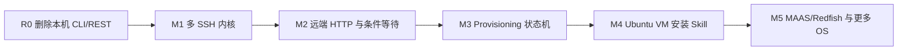

# myterm Linux Agent 开发计划

> 2026-09-01 实施边界：桌面端使用官方 DeepSeek Harness ACP 作为唯一 Agent 内核；Harness 提供 Agent Loop、Goal、压缩、本地工具和 Skill，myterm Host MCP 提供 SSH/CLI/SFTP、多 SSH 与外部 MCP。普通任务自动获得持久会话能力，不提供用户可调 `max_steps`。

> 文档状态：`0.11.1` 已交付能力与后续 OS provisioning 计划
> 当前产品基线：`0.11.1`
> 对应说明书：[`linux-agent-specification.md`](linux-agent-specification.md)
> 专项方案：[`multi-ssh-os-installation-plan.md`](multi-ssh-os-installation-plan.md)
> 研究依据：[`linux-agent-improvement-study.md`](linux-agent-improvement-study.md)

## 1. 计划目标

myterm 保持轻量桌面 SSH 终端定位，在已经交付的单主机 Linux Agent 内核上增加三项能力：

1. 一个 Agent Task 显式绑定和协调多个已保存 SSH 目标。
2. 从指定远端 SSH 主机执行大量 CLI 和结构化 REST 请求。
3. 由本地 Skill 触发 OS 安装 Task，通过独立 provisioning 控制面完成安装、观察和验收。

本计划中的 CLI/REST 都是远端运维手段，不是 myterm 自身的产品入口。`0.6.3` 已删除 `myterm agent/task/api` 子命令、loopback REST、Bearer Token、SSE、OpenAPI 和专用幂等存储。桌面启动参数 `--profile`、`--portable` 和 `--debug` 继续保留。

## 2. 完成标准

- 多主机任务的每次工具调用、审批、输出和证据都能唯一定位目标。
- A 操作、B 观察、条件满足后继续的流程无需通用 DAG 或多 Agent。
- HTTP 请求保留远端网络视角，凭据不进入 prompt、argv、日志或 Artifact 明文。
- OS 安装不是一条 shell 命令；旧 SSH 消失后由 BMC、MAAS、虚拟化或云控制面继续观察。
- Skill 只能编排内核工具，不能扩大权限或建立第二执行入口。
- 未启用多 SSH/provisioning 时没有 provider 常驻进程、监听端口、忙轮询或明显资源回退。
- 每个里程碑同时完成实现、测试、说明书、经验记录、发行构建和升级安装验证。

## 3. 实施原则

1. **桌面唯一入口**：Agent 任务从桌面 UI 创建、审批、观察和取消。
2. **显式目标**：多主机工具调用必须带 `target_alias`，不能依赖当前焦点终端。
3. **单一安全内核**：内置工具、Skill、MCP 和 provider adapter 共用权限、取消、输出限制、脱敏和审计。
4. **副作用串行**：只读探针可有界并发，跨主机写默认串行；并行写单独审批。
5. **安装计划先行**：OS 安装先产生不可变 plan 和 plan hash，再进入两阶段审批。
6. **控制面独立**：系统盘安装期间不依赖被重装 OS 的 SSH。
7. **最少 provider**：第一版只选择一个 VM adapter，不静态打入全部云和硬件 SDK。
8. **契约先行**：先修改说明书、类型和状态，再实现服务和 UI。
9. **经验同步**：每个里程碑把决定、失败和证据写入 `development-experience.md`。
10. **轻量门槛**：体积、内存、CPU、启动和长输出指标回退时不发布。

## 4. 当前基线

### 4.0 Goal + 官方 DeepSeek Harness ACP

桌面宿主持久化产品级 Goal、输入队列、后台 Job 和审计；官方 DeepSeek Harness 独占模型工具循环、持久 Session、上下文压缩、Harness Goal、本地工具和 Skill。用户不需要 `/goal` 或长短任务选择，也不再暴露旧 Core 的 64 Step 边界。

Harness Local Tools 提供本机 Shell/文件能力；SSH/CLI/SFTP、多 SSH 和外部 MCP 由受保护的 myterm Host MCP 提供。外部 MCP 通过统一 CapabilityProvider 接入 stdio/streamable-http Tools、Resources 和 Prompts；所有远程能力共用权限、取消、输出限制和审计，不能提升权限。

本阶段选择官方 Harness ACP sidecar 的原因是能直接跟随上游 Agent Loop、Goal、压缩、Skill 和本地工具更新，避免继续维护 Core 分叉。代价是安装包需要携带 Node，运行时资源约 236 MiB，且官方 Harness 仍处于 Developer Preview。myterm 只维护 ACP 与 Host MCP 边界，不再扩展旧 `agent/protocol.rs` 为第二套插件运行时。

### 4.1 已交付

- 保存服务器新增、修改、删除、凭据持久化、点击连接和自动登录。
- 本地终端、SSH 标签、向右分屏、分屏关闭、SFTP 和多行快捷命令。
- 三套主题、紧凑工作区、离线帮助与中英文 README。
- Claude Code 风格的单 Agent 循环、持久 Task/Event/Approval/Audit、取消和历史。
- `remote_exec`、后台 Job、主机事实、远端文件读写、tree-sitter Bash 权限策略和证据式完成。
- 本地 `SKILL.md`、stdio/streamable-http MCP、Hooks、上下文压缩、工具时间线和 0.7.0 插件运行时。
- Agent 输入框 `Enter` 提交、`Shift+Enter` 换行、IME 组合保护，以及向上拖至面板一半的可调高度。
- 自动 Goal、持久 Harness Session、澄清等待、后台 Job、重启恢复和运行中“响应后继续/排队执行”。
- 跨 Provider 模型路由、官方 Harness compaction/Goal/Skill、本地工具，以及 Host MCP 包装的 MCP Tools/Resources/Prompts。
- 多 SSH 自动连接、显式 Session 目标、同会话写锁、跨会话并发和 `session_wait_until` 条件协同。

### 4.2 `0.6.3` 删除项

- `myterm agent run/serve`。
- `myterm task list/status/events/approve/cancel`。
- `myterm api serve/token`。
- Axum listener、REST Token、rate limit、SSE、OpenAPI 和 API 幂等键。
- CLI/REST smoke 脚本、专用依赖和文档。

升级迁移会删除配置中的 `rest_token_hash` 和 Agent 数据库中的 `api_idempotency_keys`，但保留桌面 Task 历史、Agent 设置、服务器、AI 配置和系统凭据。

### 4.3 尚未交付

- 独立结构化 `remote_http_request`（当前可通过明确 SSH 来源执行受控 CLI/HTTP 命令）。
- Provisioning plan、状态机、provider adapter 和 OS 安装 Skill。
- 物理机、虚拟化平台或云控制面接入。

## 5. 版本与里程碑

| 版本 | 里程碑 | 核心交付 | 依赖 |
|---|---|---|---|
| `0.6.3` | R0 产品面收敛 | 删除本机 CLI/REST、迁移旧数据、多行与可调输入区、文档重构 | `0.6.2` |
| `0.7.0-0.10.1` | Agent 基线演进 | 插件边界、多 SSH、Conversation/Turn、Provider Context、Result Capsule | R0 |
| `0.11.0` | Goal 控制面 | 普通任务自动 Goal、透明续跑、Job/Evidence/Skill 恢复、统一 MCP、跨 Provider 路由 | 既有 Core |
| 开发版 | 官方 Harness 迁移 | ACP sidecar、Harness 本地工具、Host MCP、持久 Session、私有 Node 打包 | `0.11.0` 产品控制面 |
| 后续 | M2 远端 HTTP 协同 | `remote_http_request` 与来源/凭据/幂等契约 | `0.11.0` |
| 后续 | M3 Provisioning 骨架 | plan、状态机、fake adapter、两阶段审批、安装 Skill plan-only | M2 |
| `1.0.0` 候选 | M4 Ubuntu VM 安装 | 一个 VM adapter、Autoinstall、SSH 身份重建和验收 | M3 |
| 后续 | M5 物理机与更多 OS | MAAS/Redfish、RHEL、Windows、云 provider | M4 稳定后 |

版本号表达能力成熟度，不承诺日历工期。每个里程碑通过退出门槛后才能开始依赖它的下一里程碑。

## 6. 依赖顺序



不能先写 OS 安装脚本再补状态机。不能先接 BMC/云 API 再补资产身份和审批。不能为了并行开发复制 SSH、HTTP、凭据或策略实现。

## 7. 里程碑明细

### R0 产品面收敛

目标：让实现、文档和产品定义都只保留桌面入口，并为后续多目标工作建立干净基线。

交付物：

- 删除 `cli.rs`、`rest.rs` 和 REST smoke 脚本。
- 删除 `clap`、`axum`、`tokio-stream` 及不再需要的 Tokio/Windows feature。
- Agent SQLite schema 升级并删除 API 幂等表。
- 配置打开时清理旧 REST Token hash。
- 桌面仍解析 `--profile`、`--portable`、`--debug`。
- Agent 输入框支持 `Shift+Enter` 换行，IME 组合阶段不提交。
- 输入区从顶部向上拖动扩大，最大占 Agent 面板高度一半；支持向下恢复和键盘调整。
- README、使用说明、研究、规范、计划和经验记录同步。

退出门槛：

- `rg` 不再发现本机 Agent CLI/REST 命令、路由、Token、SSE 或 OpenAPI 实现。
- 旧配置升级后只移除 REST Token，配置 hash 变化可解释，服务器和 AI 凭据可继续使用。
- 旧 Agent DB 升级后 Task 历史可读，`api_idempotency_keys` 不存在。
- `myterm.exe agent` 不再进入 headless 模式；桌面 `--profile` 自动连接通过。
- 前端、Rust、发行构建、覆盖安装和桌面启动验证通过。
- 输入区指针与键盘缩放、窗口缩小时的高度上限和三主题视觉验证通过。

### M1 多 SSH 内核

目标：一个 Agent Task 安全绑定 2-8 个已保存服务器，并让每项事实都有明确目标。

交付物：

- `AgentTask.targets`：alias 到 existing session/profile 的冻结映射。
- 单主机兼容：允许一个 `default_target`，多主机调用必须显式 alias。
- profile ID、host、port、user、环境、host key 和凭据引用快照。
- 每目标连接 owner、连接状态、只读信号量和副作用写锁。
- Event、ToolCall、Approval、Job、Artifact 和 Evidence 增加 target alias/identity。
- 工具 schema、策略资源和审计键统一增加目标。
- AI 面板展示目标集合、每步目标、连接和锁状态。

退出门槛：

- 焦点标签切换、profile 修改或删除不能静默改变运行中 Task。
- 任一无目标或未知 alias 的工具调用在执行前失败。
- 逐目标断线和取消不污染其他目标状态。
- 旧单主机 Task 历史迁移后仍可查看。
- 未启用多主机时单主机延迟和内存不显著回退。

### M2 远端 CLI/REST 协同

目标：支持 A 操作、B 观察、条件满足后继续，并让 REST 请求具有结构化语义。

交付物：

- `remote_exec(target_alias, ...)` 完整迁移。
- `remote_http_request(observer_alias, method, url, credential_ref, ...)`。
- `wait_condition` 支持 HTTP、TCP、SSH exit/status 和受限文本比较。
- 明确 `execution_origin=remote:<alias>`，第一版不开放本机任意 HTTP。
- credential reference 受控注入，禁止 secret 进入 argv 和事件。
- 有界轮询、连续成功阈值、超时、取消、状态变化压缩和 Artifact 上限。
- 一个标准 A/B 协同 runbook 与 AI 时间线。

退出门槛：

- 两台 SSH 测试机完成 A 变更、B 连续三次健康验证和门控继续。
- 超时、TLS 失败、401、非幂等 POST、断线和取消均有稳定结果。
- HTTP secret 在 prompt、日志、SQLite、事件和截图中均不可见。
- 副作用默认串行；并行写未经专门审批不能发生。

### M3 Provisioning 骨架

目标：先证明安装 Task 可以安全建模和恢复，不触碰真实系统盘。

交付物：

- Asset identity、InstallRequest、不可变 InstallPlan 和 plan hash。
- Provisioning 状态机：验证、计划审批、staging、破坏审批、执行、重启、发现、引导、验证和恢复。
- `ProvisioningAdapter` 最小 trait 与确定性 fake adapter。
- `provision_capabilities/plan/validate/apply/status/console/abort` 工具。
- 两阶段审批、精确磁盘稳定 ID、镜像 digest 和备份证据。
- `install-linux-os` Skill 样例，仅支持 plan-only 与 fake adapter。
- 应用重启后的任务恢复、provider 未知状态和 `recovery_required`。

退出门槛：

- fake adapter 覆盖全部终态、每个阶段失败、崩溃恢复和审批 hash 失效。
- 进入破坏阶段后的取消不会伪报回滚成功。
- Skill 直接运行写盘/BMC 脚本会被策略拒绝。
- 没有启用 provisioning 时不启动 adapter 或轮询。

### M4 Ubuntu VM 安装 Skill

目标：在可销毁实验 VM 中完成第一个真实 OS 安装闭环。

实施前 ADR：根据真实测试环境选择一个虚拟化平台 adapter。已有 Proxmox、vSphere、Hyper-V 或 libvirt 时优先复用；不为了演示同时实现多个。

交付物：

- Ubuntu Server Autoinstall 模板、schema/语义 validator 和镜像 hash 校验。
- VM 资产绑定、快照/备份证据、虚拟介质、一次性启动、电源和控制台事件。
- 安装器事件或串口观察，旧 SSH 中断被识别为预期阶段。
- 一次性 bootstrap key、新 host key 验证、正式凭据绑定和凭据撤销。
- SSH、地址、DNS、默认路由、时间同步和磁盘布局后置检查。
- 仅允许 `development`/`lab` 环境、单 VM 和人工两阶段审批。

退出门槛：

- 连续至少 10 次全新安装成功。
- 镜像错误、磁盘错误、网络失败、引导失败和身份不匹配注入测试通过。
- 任何目标、磁盘或镜像变化都使旧审批失效。
- UI 清楚区分预期 SSH 中断、安装失败和恢复待处理。

### M5 物理机与更多 OS

优先顺序：

1. 已有 MAAS 时实现 MAAS adapter。
2. 没有 MAAS且硬件型号固定时，评估直接 Redfish + VirtualMedia/PXE adapter。
3. Ubuntu 稳定后增加 RHEL Kickstart。
4. Windows 使用独立 Skill、Windows PE 和 unattended 模板。
5. 云平台按业务需要实现镜像/启动盘 provider，不通过 SSH 重装。

每个物理机型号必须进入能力矩阵和认证测试。未认证型号只能 plan-only。

## 8. 数据迁移与兼容

### 8.1 `0.6.3`

- 配置 schema 不删除通用 `settings`，只删除键 `rest_token_hash`。
- Agent DB schema 从 3 升到 4并删除 `api_idempotency_keys`。
- 不删除 Task/Event/Approval/Job/Artifact。
- 不删除 Windows 凭据库中的服务器、私钥口令或 AI Key。
- 旧 `myterm agent/task/api` 调用直接回到桌面启动行为，不再承诺 CLI 错误码或兼容提示。

### 8.2 M1 以后

- 单 `session_id`/profile 的旧 Task 映射为 alias `primary`。
- 新 Event 字段只追加；无法推导 target 的旧事件显示“历史单目标”，不伪造 profile。
- InstallPlan 一经审批不可修改；修改产生新 plan ID/hash。
- Provider 版本和 schema 记录在每次安装任务中，升级不重写历史证据。

## 9. 效率预算

| 指标 | 发布预算 |
|---|---|
| 原生主进程空闲 private working set | `<= 12MiB` |
| 完整 desktop/WebView2 进程组 | 继续以 `<80MiB` 为目标并如实报告当前差距 |
| 空闲 CPU | `<= 1%` |
| NSIS 与便携 ZIP | 各 `<20MiB`；单里程碑增加 `>1MiB` 必须 ADR |
| 10MiB 命令输出 | UI 不阻塞；内存窗口合计默认 `<=2MiB` |
| 远端条件等待 | 仅状态变化持久化；无每秒数据库忙写 |
| 未启用 provider | 0 listener、0 provider child、0周期轮询 |
| 多目标默认并发 | Task 只读 4、每目标只读 2、每目标副作用 1 |

Provider 优先使用轻量 HTTP 契约或外部受控服务，不因一个厂商接入把全部 SDK 静态链接到主程序。

## 10. 全程测试门槛

每个里程碑至少运行：

```powershell
npm run typecheck
npm run lint
npm test
npm run build
cargo fmt --manifest-path src-tauri/Cargo.toml -- --check
cargo check --manifest-path src-tauri/Cargo.toml
cargo clippy --manifest-path src-tauri/Cargo.toml --all-targets -- -D warnings
cargo test --manifest-path src-tauri/Cargo.toml
npm run build:release
npm run check:dist
```

并完成：

- 浏览器桌面与窄窗口几何、溢出和控制台错误检查。
- 安装包覆盖旧版本、单一卸载项、桌面快捷方式和配置迁移检查。
- 保存服务器自动登录、Agent 单主机回归和凭据 secret 扫描。
- 新增能力对应的真实 SSH/provider 集成测试和故障注入。
- 发行前 `rg` 残留扫描和依赖树/包体积对比。

## 11. 主要风险与预案

| 风险 | 预防 | 失败处理 |
|---|---|---|
| 工具发到错误主机 | alias 必填、目标冻结、审批显示身份 | 执行前拒绝，不能自动选择焦点终端 |
| A 成功但 B 观察失败 | 独立证据和条件超时 | 停止后续副作用，进入验证失败 |
| 多主机并发写冲突 | 每目标写锁、副作用串行 | 取消未开始 Job，保留已执行证据 |
| HTTP secret 泄漏 | vault ref、受控注入、持久化前脱敏 | 阻断结果并提示轮换凭据 |
| 重装后 SSH 消失 | 独立 provider 状态机 | 通过控制面继续，不盲目重连旧会话 |
| 写错系统盘 | 稳定磁盘 ID、两阶段审批、plan hash | 写盘前硬拒绝；写盘后 recovery_required |
| Redfish 厂商差异 | 型号能力矩阵和认证 | 未认证型号 plan-only |
| Provider 使软件臃肿 | 单 adapter、懒加载、依赖体积 ADR | 超预算不发布或改为外部受控 adapter |
| Skill 绕过策略 | Skill 脚本注册为工具并过统一策略 | deny 优先，记录 Skill hash |

## 12. 每个里程碑的完成定义

只有同时满足以下条件才可标记完成：

1. 说明书、领域类型、事件、错误和迁移已更新。
2. 核心 happy path 与失败路径均有自动测试。
3. 至少一次真实环境集成验证，无法执行的外部验收明确列出。
4. 权限、secret、取消、恢复和错误目标回归通过。
5. 体积、内存、CPU、启动和长输出指标已测量并记录。
6. 三主题、桌面和窄窗口没有重叠、截断或不可达操作。
7. 安装包覆盖升级、配置保留、桌面快捷方式和自动登录通过。
8. `development-experience.md` 记录决定、失败、修复和证据。
9. Git 工作树只包含本里程碑相关改动，提交并推送成功。
