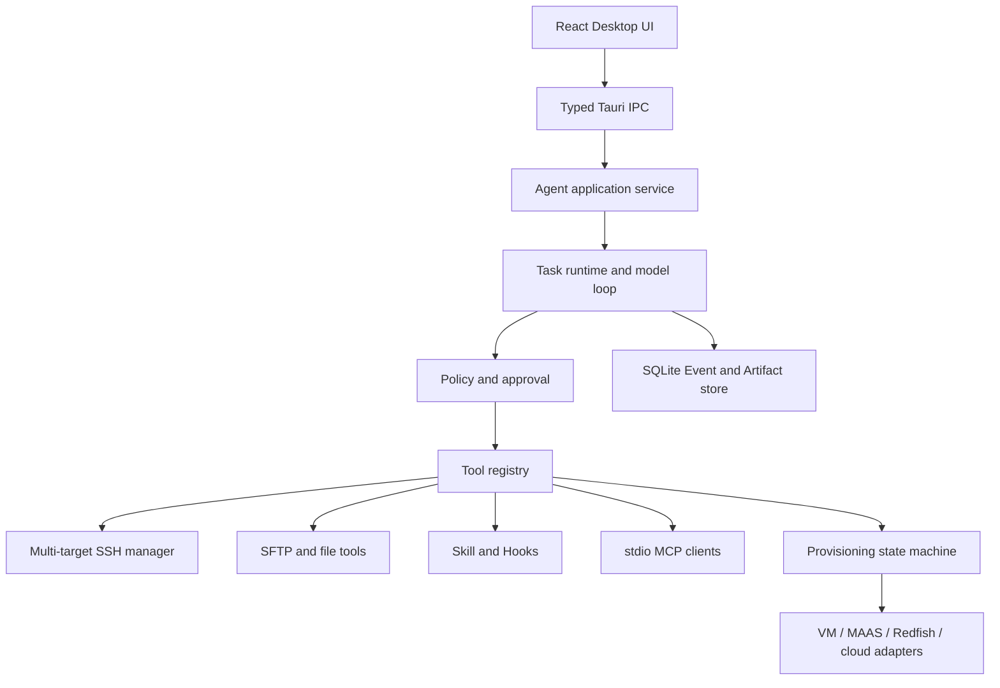
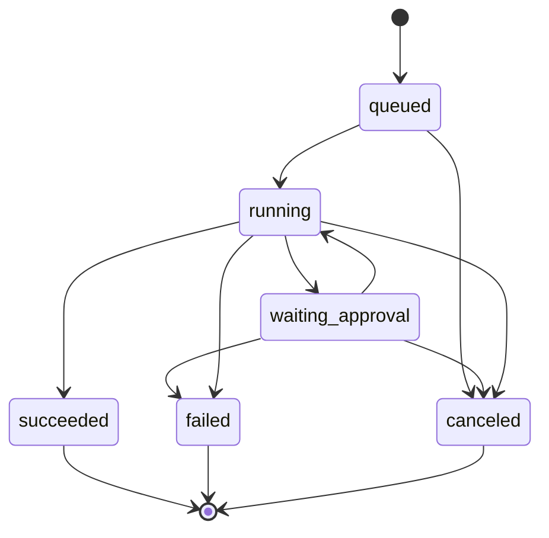
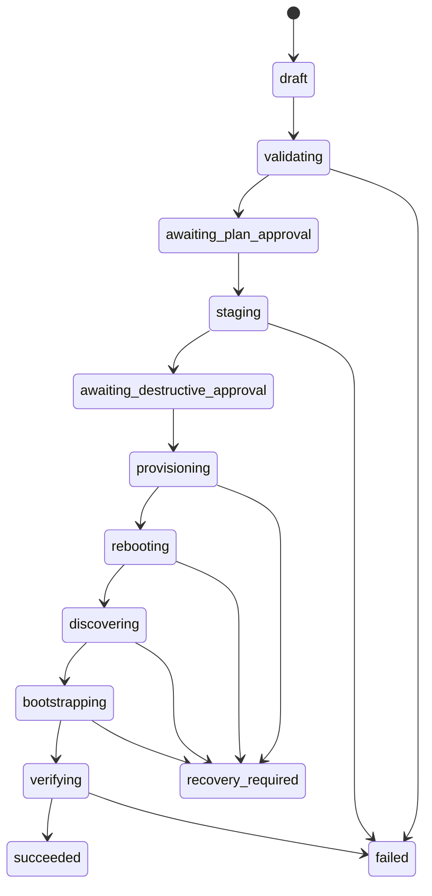

# myterm Linux Agent 功能与技术说明书

> v0.9.1 实现说明：桌面端 Agent Loop、Thread/Turn、上下文压缩和 Subagent Graph 由 `dsh-codex-agent`/Codex Core 独占。下文涉及旧循环步数或插件挂载字段的示例用于协议研究，不代表当前桌面配置项。

> 文档状态：`0.6.3` 当前契约与后续目标单一事实源
> 当前产品入口：Desktop only
> 开发计划：[`linux-agent-development-plan.md`](linux-agent-development-plan.md)
> OS 安装专项方案：[`multi-ssh-os-installation-plan.md`](multi-ssh-os-installation-plan.md)

## 1. 文档职责

本文定义 myterm Linux Agent 的产品行为、架构边界、任务模型、工具、权限、事件、多 SSH、远端 CLI/REST、Skill、MCP、OS provisioning、安全和验收标准。

文档优先级：

1. Linux Agent 范围内以本文为准。
2. OS 安装的技术选择和分阶段范围以专项方案为准。
3. 终端、SSH、SFTP、配置和安装器既有行为继续以 `myterm-spec/` 为准。
4. 实现需要改变契约时，先修改本文与开发计划，再修改代码。

每项能力必须标记为当前或规划，不能因为文档存在就宣称已经交付。

## 2. 产品定义

myterm 是桌面 SSH 终端和受控 Linux 运维 Agent。用户在桌面 Agent 面板输入目标，模型读取上下文、选择工具、经过策略和审批、执行并观察结果，最终以执行证据和验证证据回答。

### 2.1 产品目标

- 可靠执行远端 Linux CLI，获得退出码、stdout、stderr、超时、取消和完成边界。
- 在一个 Task 中显式协调多个已保存 SSH 目标。
- 从指定远端主机执行结构化 HTTP 请求，保留真实网络视角。
- 使用本地 Skill 承载重复 runbook 和 OS 安装流程。
- 使用 MCP 扩展工具，但不允许 MCP 绕过内核策略。
- 对系统变更提供目标、风险、审批、审计和验证证据。
- 通过 provisioning 控制面支持可恢复的 OS 安装任务。
- 保持内核和发行包轻量，不演进成通用自动化平台。

### 2.2 产品入口

Agent 只有桌面入口：

- 在桌面输入任务。
- 在桌面选择权限、目标、Skill/MCP 和 AI profile。
- 在桌面审批、观察、取消、恢复和查看历史。

`--profile`、`--portable` 和 `--debug` 是桌面启动参数，不是 CLI 产品接口。

`0.6.3` 起不提供 `myterm agent`、`myterm task`、`myterm api`、本机 REST listener、SSE 或 OpenAPI。本文中的 CLI/REST 均指远端 SSH 环境中的运维命令和 HTTP 请求。

### 2.3 非目标

- 不提供通用多 Agent、Agent 团队或自动长期记忆。
- 不提供任意 DAG、CI/CD 平台或云端 Skill 市场。
- 不把本地 Windows 沙箱宣称为远端 Linux 安全边界。
- 不允许 Prompt、Skill、Hook、MCP 或 full access 覆盖 hard deny。
- 不通过 `dd`、`curl | sh`、交互 PTY 或单条命令重装系统。
- 不在 myterm 内自建 DHCP/PXE/镜像仓库。
- 不承诺系统盘覆盖后的通用自动回滚。

## 3. 术语

| 术语 | 含义 |
|---|---|
| Task | 一次用户目标及其完整 Agent 循环，标识为 `run_id` |
| Step | 一次模型决策轮次 |
| Tool call | 模型请求执行的一个内置或 MCP 工具调用 |
| Job | 可查询、输出和取消的执行单元，标识为 `job_id` |
| Target | Task 绑定的一个 existing session 或保存 profile |
| Target alias | Task 内稳定引用某 Target 的短名称 |
| Execution origin | CLI/HTTP/探针实际从哪里发起 |
| Event | Task 生命周期中的不可变事实，按 `sequence` 排序 |
| Artifact | 完整输出、diff、控制台片段或导出文件 |
| Effect | `read`、`write`、`delete`、`service`、`network`、`identity`、`power`、`storage` |
| Resource | 主机、路径、服务、包、端口、磁盘、介质或 provider 资产 |
| Approval | 用户对精确工具调用或 plan hash 的决定 |
| Evidence | 支撑“执行过”和“目标满足”的结构化结果 |
| Skill | 含 `SKILL.md` 的本地流程、知识和资源目录 |
| Provider adapter | BMC、MAAS、虚拟化或云控制面的确定性适配器 |
| InstallPlan | 经验证且不可变的 OS 安装计划 |

## 4. 能力状态

| 能力 | `0.6.3` | 目标版本 |
|---|---:|---:|
| 单主机结构化 SSH CLI | 已实现 | 持续维护 |
| 持久 Task/Event/Approval/Audit | 已实现 | 持续维护 |
| 主机事实、文件工具、后台 Job | 已实现 | 持续维护 |
| 本地 Skill、stdio MCP、Hooks | 已实现 | 持续维护 |
| Agent 多行与可调高度输入 | 已实现 | `0.6.3` |
| 本机 Agent CLI/REST | 已删除 | 不再规划 |
| 多 SSH Task | 未实现 | `0.7.0` |
| 结构化远端 HTTP/条件等待 | 未实现 | `0.8.0` |
| Provisioning fake adapter/plan-only Skill | 未实现 | `0.9.0` |
| Ubuntu VM 自动安装 | 未实现 | `1.0.0` 候选 |
| 物理机与更多 OS | 未实现 | 后续 |

## 5. 用户场景

| ID | 场景 | 完成标准 |
|---|---|---|
| US-01 | 检查单机磁盘压力 | 只读探针返回退出码、关键证据和结论 |
| US-02 | 排查失败服务 | 识别 init、检查状态和日志，不无确认重启 |
| US-03 | 修改配置并 reload | 展示 diff，写入、语法检查、reload 和验证形成证据链 |
| US-04 | 运行耗时部署命令 | 可看 stdout/stderr、Job 状态并取消 |
| US-05 | A 变更后从 B 观察 | 每步目标明确，B 条件连续满足后才继续 |
| US-06 | 从 B 调用 A 的 REST 健康接口 | 记录 `remote:B`、status/TLS/耗时，secret 不落盘 |
| US-07 | 由 Skill 规划 Ubuntu VM 安装 | 生成 plan、验证模板、展示系统盘与镜像，不写盘 |
| US-08 | 经审批执行 Ubuntu VM 安装 | SSH 断开期间用 provider 观察，重建身份并后验 |
| US-09 | 用户关闭再打开 Agent 面板 | Task 和事件可恢复，不重复执行工具 |
| US-10 | 模型重复失败调用 | 循环保护暂停，不继续消耗步骤或破坏系统 |

## 6. 功能需求

### 6.1 Task 与循环

| ID | 需求 |
|---|---|
| FR-TASK-001 | 每个 Task 必须有 UUID `run_id`，模型请求前持久化。 |
| FR-TASK-002 | Task 必须记录 AI profile、prompt、权限、目标快照、时间、状态和 finish reason。 |
| FR-TASK-003 | 循环必须是“模型决策 -> 工具策略/审批 -> 执行 -> 结果持久化 -> 继续模型”。 |
| FR-TASK-004 | 模型文字不能覆盖真实工具结果或 Task 状态。 |
| FR-TASK-005 | 取消传播到模型请求、审批等待、SSH channel、Job、条件等待和 provider。 |
| FR-TASK-006 | 模型步骤默认 8，范围 1-32；达到上限写独立 finish reason。 |
| FR-TASK-007 | 相同工具与规范化参数连续 3 次触发循环保护。 |
| FR-TASK-008 | Task、Event、Approval 和 Artifact 在 UI 关闭后可恢复。 |
| FR-TASK-009 | 默认全局同时运行 1 个 Agent Task，其他 Task 排队。 |
| FR-TASK-010 | 每个 Task 必须进入可解释终态。 |

### 6.2 目标与多 SSH

| ID | 需求 |
|---|---|
| FR-TARGET-001 | Task 支持 1-8 个 Target，使用 Task 内唯一 alias。 |
| FR-TARGET-002 | Target 创建时冻结 profile/session、host、port、user、环境和 host key 身份。 |
| FR-TARGET-003 | 多目标工具调用必须显式带 alias；UI 焦点不能改变运行目标。 |
| FR-TARGET-004 | Event、ToolCall、Approval、Job、Artifact 和 Evidence 必须记录 target alias。 |
| FR-TARGET-005 | 每目标同时最多一个有副作用 Job；只读并发受界限控制。 |
| FR-TARGET-006 | profile 编辑/删除、目标断线和 host key 变化必须产生明确事件。 |
| FR-TARGET-007 | 并行写默认禁止，显式启用时审批必须列出完整目标集合。 |

### 6.3 远端 CLI 与 HTTP

| ID | 需求 |
|---|---|
| FR-EXEC-001 | 非交互命令使用 `remote_exec`，返回 exit code、stdout、stderr、耗时和 termination。 |
| FR-EXEC-002 | PTY `terminal_send` 只表示输入已发送，不能声称命令成功。 |
| FR-EXEC-003 | stdout/stderr 增量发布、受限驻留并落入 Artifact。 |
| FR-EXEC-004 | SSH 执行支持超时、取消、断线和输出上限。 |
| FR-HTTP-001 | `remote_http_request` 必须从指定 SSH observer 发起。 |
| FR-HTTP-002 | HTTP 结果记录 execution origin、method、目标、TLS、status、耗时、大小和截断。 |
| FR-HTTP-003 | HTTP credential 只接受 vault ref，不接受 prompt 或普通 argv 中的 secret。 |
| FR-HTTP-004 | 非幂等请求默认不重试；重试决定和结果进入审计。 |
| FR-WAIT-001 | `wait_condition` 支持类型化 HTTP、TCP、SSH exit/status 和有限文本条件。 |
| FR-WAIT-002 | 条件等待必须有间隔、超时、连续成功阈值、取消和有限输出。 |
| FR-WAIT-003 | 条件表达式不接受任意 `eval`、模板代码或生成脚本。 |

### 6.4 权限与验证

| ID | 需求 |
|---|---|
| FR-POL-001 | 权限模式为 `read_only`、`confirm`、`full_access`。 |
| FR-POL-002 | 策略结果为 `deny > ask > allow`，模型不能改写。 |
| FR-POL-003 | 判定同时检查工具、解析命令、Target、用户、环境、资源和 effect。 |
| FR-POL-004 | 无法解析或分类的 shell 表达式不得自动执行。 |
| FR-POL-005 | `full_access` 在 root/production 也不再逐次确认，但 hard deny 仍然优先拒绝。 |
| FR-POL-006 | 审批绑定规范化参数、目标身份和过期时间。 |
| FR-POL-007 | 系统变更最终答复前必须有验证 Evidence 或明确 verification_failed。 |
| FR-POL-008 | Prompt、Skill、Hook 和 MCP 不能降低 hard deny。 |

### 6.5 Skill、MCP 与 Hooks

| ID | 需求 |
|---|---|
| FR-SKILL-001 | 从配置的本地目录发现标准 `SKILL.md`，记录路径、hash、来源和启用状态。 |
| FR-SKILL-002 | 初始上下文只注入元数据，正文、references 和 scripts 按需加载。 |
| FR-SKILL-003 | Skill 脚本必须注册为工具并通过同一策略，不得由提示直接执行。 |
| FR-SKILL-004 | Skill 的权限/provider/environment 策略存于 myterm 配置并绑定内容 hash。 |
| FR-MCP-001 | 第一阶段只支持 stdio MCP，每 Task 复用连接并有超时、重连和清理。 |
| FR-MCP-002 | MCP 工具按 server/tool 授权，annotation 只能提升风险。 |
| FR-MCP-003 | 大工具目录先搜索再加载 schema，保护模型上下文。 |
| FR-HOOK-001 | Hook 可追加上下文、deny、ask 或建议验证，不能覆盖 policy deny/ask。 |

### 6.6 OS Provisioning

| ID | 需求 |
|---|---|
| FR-PROV-001 | OS 安装必须由安装 Task 和 Skill 触发，禁止单条 SSH 命令直装。 |
| FR-PROV-002 | 安装前生成不可变 InstallPlan 和 plan hash。 |
| FR-PROV-003 | plan 包含资产身份、OS、镜像 digest、boot、系统盘/保留盘、网络、访问、备份和后验。 |
| FR-PROV-004 | 磁盘使用 WWN/serial/provider stable ID，不得只使用 `/dev/sdX`。 |
| FR-PROV-005 | 计划审批和破坏审批分离，任何 plan 变化使审批失效。 |
| FR-PROV-006 | 物理/VM/云通过 provider adapter 控制，SSH 只用于前后阶段。 |
| FR-PROV-007 | SSH 在写盘和重启阶段不可用是预期状态，由控制面事件观察。 |
| FR-PROV-008 | 破坏阶段后的取消只能请求停止，不能承诺回滚。 |
| FR-PROV-009 | 重装后按资产身份验证并更新单一 profile host key，不关闭全局校验。 |
| FR-PROV-010 | `succeeded` 要求 provider 终态、SSH 重建和全部必需后置检查。 |

### 6.7 持久化与审计

| ID | 需求 |
|---|---|
| FR-AUD-001 | Task、Event、ToolCall、Approval、Job 和 Evidence 持久化到本地 SQLite。 |
| FR-AUD-002 | Event 使用 schema version、Task 内单调 sequence 和 UTC 时间。 |
| FR-AUD-003 | 审计记录目标、工具、脱敏参数、策略、审批、耗时、结果和验证。 |
| FR-AUD-004 | 密码、API Key、私钥、token 和完整敏感环境在持久化前脱敏。 |
| FR-AUD-005 | 长输出落入有限额 Artifact，Event 只保存首尾预览、hash 和引用。 |
| FR-AUD-006 | 用户可查看、导出和删除自己的任务历史。 |

### 6.8 效率

| ID | 需求 |
|---|---|
| FR-EFF-001 | SQLite worker、MCP、provider 和主机事实只按需启动。 |
| FR-EFF-002 | Desktop、Skill、MCP 和 provider 共用一个 Tokio runtime、HTTP client、SSH 和存储实现。 |
| FR-EFF-003 | 未使用 provider 时没有 listener、provider child 或周期轮询。 |
| FR-EFF-004 | 输出、事件、工具目录、并发和 Artifact 全部有界。 |
| FR-EFF-005 | 新 provider 依赖必须记录体积、license、MSRV 和维护状态。 |

## 7. 总体架构



依赖规则：

- React 只依赖类型化 IPC，不拥有 SSH、策略或持久化逻辑。
- runtime 不依赖 React、Tauri Channel 或 HTTP server 类型。
- Tool registry 是所有执行能力进入策略和审计的唯一入口。
- Target manager 拥有 SSH 连接生命周期；工具不能私自创建第二 SSH 栈。
- Provider adapter 不直接调用模型，不接受自由文本命令。
- 不创建本机 Agent REST server 或 headless CLI runtime。

## 8. Task 领域模型

### 8.1 请求

目标模型实施后，桌面 IPC 请求为：

```json
{
  "schema_version": 2,
  "prompt": "先更新 A，再从 B 观察健康接口",
  "ai_profile_id": "ai-uuid",
  "targets": {
    "app-a": { "kind": "profile", "profile_id": "profile-a" },
    "observer-b": { "kind": "profile", "profile_id": "profile-b" }
  },
  "default_target": "app-a",
  "permission_mode": "confirm",
  "max_steps": 16
}
```

`target.kind`：

- `existing_session`：带 `session_id`，Task 不拥有连接生命周期。
- `profile`：带 `profile_id`，Task 使用保存凭据连接并拥有自己创建的连接。

请求不接受密码、API Key、私钥内容或任意 vault ref。服务只从保存 profile 和允许的凭据配置解析引用。

### 8.2 Task 状态



`wait_condition` 是运行中的 Job，不增加 Task 顶层状态。Task 终态不可恢复为运行；继续或重试创建新 `run_id` 并记录 `parent_run_id`。

finish reason 至少包括：`completed`、`verification_failed`、`permission_denied`、`approval_expired`、`step_limit`、`loop_detected`、`model_error`、`connection_lost`、`provider_error`、`recovery_required`、`user_canceled` 和 `internal_error`。

### 8.3 Job 与 Target 状态

Job：`queued -> running -> succeeded | failed | canceled | timed_out | lost | unknown`。

Target connection：`disconnected -> connecting -> connected -> reconnecting | failed -> disconnected`。

每个 Job 关联一个 ToolCall 和一个或多个显式 Target。无法确认远端进程是否停止时使用 `unknown`，不能报告 canceled。

## 9. 事件协议

Canonical Event：

```json
{
  "schemaVersion": 2,
  "runId": "uuid",
  "sequence": 17,
  "createdAtMs": 1786248000000,
  "eventType": "tool.completed",
  "step": 4,
  "callId": "call-uuid",
  "targetAliases": ["observer-b"],
  "payload": {}
}
```

事件类型至少包括：

- `task.created/queued/running/completed/failed/canceled`。
- `model.started/completed/failed`。
- `tool.requested/policy/approval_required/started/output/completed/failed`。
- `target.connecting/connected/disconnected/identity_changed`。
- `condition.started/progress/satisfied/timed_out`。
- `artifact.created`、`evidence.recorded`、`context.compacted`。
- `provision.plan_created/validated/approved/staged/started/progress/recovery_required/completed`。

Event 先持久化再通知 UI。高频输出按 50ms 或 64KiB 合并，条件轮询只记录状态变化和定期摘要。

## 10. Agent 循环

1. 校验桌面请求、AI profile、目标集合和权限。
2. 冻结目标身份并持久化 Task。
3. 建立或绑定所需 Target，读取主机事实和 Skill/MCP 目录。
4. 组装最小系统上下文和按需工具目录。
5. 请求模型并持久化 model 事件。
6. 规范化每个工具参数、alias、资源和重复签名。
7. 工具声明 effect/risk，策略返回 deny/ask/allow。
8. deny 返回结构化错误；ask 持久化审批；allow 创建 Job。
9. 输出先写 Event/Artifact，再给模型有限结果。
10. 没有工具调用时检查未完成 Job、条件、安装阶段和验证证据。
11. 满足完成条件后写最终答复和终态。

模型不能直接写 Task 状态、数据库、凭据或 provider 请求。

## 11. 内置工具

### 11.1 当前工具

- `session_info(target_alias?)`。
- `terminal_context(target_alias?, lines)`。
- `terminal_send(target_alias?, command, newline)`。
- `remote_exec(target_alias?, command, cwd, timeout_ms, mode, max_output_bytes)`。
- `host_facts(target_alias?)`。
- `list_directory`、`file_stat`、`file_read`、`file_search`、`file_write`、`file_patch`。
- `job_status`、`job_output`、`job_cancel`。
- `skill_load`、`mcp_tool_search`、`mcp_tool_call`。

`0.6.3` 单目标兼容期允许省略 alias 并解析为活动 session。M1 完成后，多目标 Task 必须显式 alias。

### 11.2 `remote_exec`

```json
{
  "target_alias": "app-a",
  "command": "systemctl status nginx --no-pager",
  "cwd": "/var/www/app",
  "timeout_ms": 120000,
  "mode": "foreground",
  "max_output_bytes": 10485760
}
```

- `command` 最大 32KiB。
- `cwd` 必须为远端绝对路径并进入资源分析。
- `timeout_ms` 1,000-1,800,000，默认 120,000。
- SSH exec channel 不分配 PTY。
- termination 为 `exit`、`signal`、`timeout`、`canceled`、`connection_lost` 或 `output_limit`。
- 非零 exit code 表示命令完成但失败，不是传输错误。

### 11.3 `remote_http_request`（规划）

```json
{
  "observer_alias": "observer-b",
  "method": "GET",
  "url": "https://app-a.internal/health",
  "credential_ref": null,
  "timeout_ms": 10000,
  "max_response_bytes": 1048576
}
```

- 第一版只允许 `execution_origin=remote:<observer_alias>`。
- 默认验证 TLS，不提供全局 insecure 开关。
- headers 使用 allowlist；Authorization 由 vault ref 注入并脱敏。
- response body 超限进入 Artifact，不整体放入模型上下文。

### 11.4 `wait_condition`（规划）

```json
{
  "observer_alias": "observer-b",
  "probe": {
    "kind": "http",
    "url": "http://app-a.internal/health",
    "expect_status": [200],
    "body_contains": "ready"
  },
  "interval_ms": 3000,
  "timeout_ms": 180000,
  "success_threshold": 3
}
```

轮询间隔默认不低于 1 秒，避免远端和 SQLite 忙轮询。探针输出只保留首个失败、状态变化、最后结果和有限样本。

### 11.5 Provisioning 工具（规划）

- `provision_capabilities(asset_id)`。
- `provision_plan(request)`。
- `provision_validate(plan_id)`。
- `provision_apply(plan_id)`。
- `provision_status(installation_id)`。
- `provision_console(installation_id, cursor)`。
- `provision_abort(installation_id)`。

这些工具只接受类型化字段和已保存资产/provider 引用，不接受自由文本 BMC、云 API 或写盘命令。

## 12. 权限与风险

### 12.1 权限模式

| 模式 | 行为 |
|---|---|
| `read_only` | 仅允许策略明确识别的读取操作 |
| `confirm` | 读取自动执行，副作用逐次确认；默认 |
| `full_access` | 硬拒绝规则之外自动执行，不再弹窗确认 |

### 12.2 Hard deny 与强制审批

普通 SSH 工具 hard deny：

- `mkfs`、对块设备执行 `dd`、不受限递归删除、fork bomb。
- `curl | sh`、动态 `eval`、无法解析的组合重定向。
- 通过普通 `remote_exec` 修改系统盘、分区表或 bootloader。
- Prompt/Skill/MCP 请求跳过审批、审计或脱敏。

Provisioning 专用强制审批：

- 系统盘、分区、RAID、LVM、bootloader。
- 虚拟介质、一次性启动、电源、重启和 BMC 操作。
- 管理网络、认证、SSH 信任和旧启动盘/备份删除。

上述 provisioning 操作只有类型化工具可执行，且必须经过 plan 与破坏两阶段审批。`full_access` 不能覆盖硬拒绝规则。

## 13. Skill、MCP 与 Hooks

### 13.1 Skill

Skill 目录遵循 Agent Skills 基本结构：

```text
skill-name/
  SKILL.md
  scripts/
  references/
  assets/
```

- `SKILL.md` 标准元数据只要求小写 hyphen name 和 description。
- 适用 environment、允许 provider、信任和审批策略由 myterm 配置持有并绑定 Skill hash。
- Skill 正文是模型指导，不是预授权。
- scripts 只作为注册工具运行，进入统一 policy、cancel、output 和 audit。
- OS 安装 Skill 负责收集参数、选择 provider、生成/验证 plan 和解释结果。

### 13.2 MCP

- 第一阶段 stdio transport。
- Task 生命周期复用连接，启动、list、call、close 各有超时。
- 工具名包含 server namespace；schema hash 进入审计。
- 工具超过阈值时先搜索目录。
- MCP 适合非核心扩展；OS 写盘第一版优先内置 provider adapter。

### 13.3 Hooks

支持 `SessionStart`、`PreToolUse`、`PostToolUse`、`ToolFailure`、`PreCompact` 和 `Stop`。Hook 可追加上下文、deny、ask 或建议验证；allow 不能覆盖 policy ask/deny。

## 14. OS 安装状态机

### 14.1 InstallPlan

InstallPlan 必须包含：

- asset ID、serial、system UUID、MAC 和 provider identity。
- OS family/version、image URI、SHA-256 和签名状态。
- firmware/boot mode、系统盘稳定 ID、保留盘稳定 ID。
- 网络、bootstrap SSH key ref、备份/维护窗口证据。
- post checks 与允许的恢复动作。

审批展示上述精确值并绑定 plan hash。

### 14.2 状态



- staging 只下载、校验和挂载准备，不写系统盘。
- provisioning 开始后取消可能进入 `recovery_required`。
- rebooting/discovering 使用 provider 观察，旧 SSH 不参与。
- bootstrapping 使用一次性凭据并验证新 host key。
- succeeded 前撤销一次性凭据并完成全部必需 post checks。

### 14.3 Provider 选择

| Provider | 优点 | 缺点 | 优先级 |
|---|---|---|---|
| VM platform | 控制台、介质、快照、电源结构化，实验成本低 | 每平台 API 不同 | 第一版 |
| MAAS | 成熟物理机生命周期、BMC/PXE/curtin/cloud-init | 需要独立基础设施 | 第二版优先 |
| Direct Redfish | 独立于 OS、无需完整 MAAS | 厂商差异和 PXE/镜像复杂 | 固定认证型号 |
| Cloud API | 镜像和启动盘状态清晰 | provider 绑定 | 按需 |

## 15. Desktop Agent 控制台

### 15.1 输入

- 输入框为有界多行 textarea。
- `Enter` 提交非空 Task。
- `Shift+Enter` 插入换行，不提交。
- IME composition 期间 `Enter` 不提交。
- 顶部水平拖柄向上扩大、向下缩小输入区；最大高度不得超过 Agent 面板高度的 50%。
- 拖柄支持 `ArrowUp`、`ArrowDown`、`Home` 和 `End` 键，并暴露当前、最小和最大值。
- 窗口或面板缩小时自动收敛到新上限，不遮挡标题栏或提交按钮。
- 运行中输入禁用，按钮切换为停止。

### 15.2 固定上下文

当前显示活动服务器、环境、用户、cwd、权限和 Task 状态。M1 后显示全部 alias/Target、连接和锁状态；焦点变化不改变 Task。

### 15.3 时间线

- 展示模型步骤、工具、目标、execution origin、风险、审批、执行、验证和终态。
- stdout/stderr 分开，默认预览，可打开 Artifact。
- 条件等待显示最近探针、连续成功和剩余时间。
- OS 安装显示 plan hash、硬件身份、系统盘、镜像 digest、provider、审批阶段和恢复状态。
- 风险和状态不能只用颜色表达。

## 16. 数据与迁移

SQLite 表：

- `schema_meta`、`agent_tasks`、`agent_events`。
- `tool_calls`、`approvals`、`execution_jobs`。
- 后续增加 `task_targets`、`evidence`、`install_plans`、`installations` 和 `provider_events`。

`0.6.3` schema version 4 删除 `api_idempotency_keys`。配置打开时删除 `rest_token_hash`。这两项属于已删除本机 REST 的专用数据；服务器、AI、Agent 设置和 Task 历史不得受影响。

## 17. 错误模型

| Code | 含义 | 可重试 |
|---|---|---:|
| `invalid_input` | 参数、alias、plan 或条件非法 | 修正后 |
| `target_not_found` | Target/asset 不存在 | 否 |
| `target_identity_changed` | host key/资产身份变化 | 人工确认 |
| `permission_denied` | policy deny | 否 |
| `approval_required` | 等待用户 | 审批后 |
| `approval_expired` | 审批过期或 plan hash 变化 | 重新审批 |
| `connection_lost` | SSH 断线 | 视任务 |
| `command_failed` | 非零 exit code | 视命令 |
| `condition_timed_out` | 等待条件超时 | 视条件 |
| `provider_error` | BMC/VM/cloud 控制面错误 | 视状态 |
| `recovery_required` | 自动恢复不可确认 | 人工处理 |
| `output_limit` | 输出超过预算 | 调整后 |
| `model_error` | 模型协议/网络错误 | 有界重试 |
| `internal_error` | 不变量或存储错误 | 否 |

错误必须包含稳定 code、人类 message、target/provider、retryable 和 details；不包含 secret。

桌面 IPC 使用 `{ code, message }` 传输错误。`message` 必须保留底层可验证详情，不能被“连接失败”或推测性的状态解释覆盖；Agent 事件使用 `errorCode` 和 `content` 携带同一份信息。测试连接结果使用 `stage`、`code`、`summary`、`detail` 和可选 `stack`；概括显示失败位置和错误码，详情交互显示原始请求诊断和调用堆栈。允许的处理只有凭据脱敏和有界截断，且截断必须有明确标记。HTTP 诊断至少保留状态、Endpoint 和响应体，远端命令至少保留退出码、stdout/stderr、超时/取消状态，MCP 至少保留启动或调用错误。

## 18. 非功能要求

### 18.1 安全

- Windows Credential Vault 是 secret 的唯一持久来源。
- 非 HTTPS AI endpoint 持续显示风险，日志不记录 header/body。
- 远端 root 安全依赖服务器最小权限账号、受限 sudo 和审计。
- OS image 固定版本和 digest，来源 allowlist，有签名时验证签名。
- 新依赖记录用途、license、MSRV、体积和维护状态。

### 18.2 可靠性

- Event 和 Task 状态事务一致。
- 应用启动时修复遗留 running/waiting 状态为可解释状态。
- 取消不宣称超出系统实际能确认的结果。
- provider 失联时保留最后状态和恢复步骤，不反复重启。

### 18.3 性能

| 指标 | 预算 |
|---|---|
| 原生主进程空闲 private working set | `<=12MiB` |
| 完整 WebView2 进程组 | 目标 `<80MiB`，未达时如实报告 |
| 空闲 CPU | `<=1%` |
| NSIS/portable | 各 `<20MiB` |
| Job stdout/stderr 内存窗口 | 合计默认 `<=2MiB` |
| 模型单次工具结果 | 默认 `<=12,000` 字符 |
| Event 发布 p95 | `<250ms`，不含模型/远端网络 |
| 未启用 provider | 0 listener、0 child、0周期轮询 |

### 18.4 UI

- 三主题、桌面、900x650 和 390x844 无重叠或水平溢出。
- 长命令、路径、Target、stdout/stderr 和错误不会撑破容器。
- 图标按钮有可访问名称和 tooltip。
- 固定控制尺寸不因动态内容跳动。

## 19. 验收矩阵

| 能力 | 必测情况 | 需求 |
|---|---|---|
| Task | 正常、失败、取消、审批、步骤上限、崩溃恢复 | FR-TASK |
| 单机执行 | 0/非0、stderr、signal、超时、长输出、断线 | FR-EXEC |
| 多 SSH | alias、焦点切换、profile 变化、锁、逐目标断线 | FR-TARGET |
| 远端 HTTP | origin、TLS、status、secret、重试、取消 | FR-HTTP |
| 条件等待 | 连续成功、超时、状态变化、输出上限 | FR-WAIT |
| 权限 | 管道、重定向、root、production、hard deny | FR-POL |
| Skill/MCP/Hook | 按需加载、脚本策略、崩溃、Hook deny | FR-SKILL/MCP/HOOK |
| Provisioning | plan hash、磁盘、审批、阶段失败、恢复 | FR-PROV |
| Desktop | Shift+Enter、IME、输入区缩放上限、目标、审批、Job、窄窗口、三主题 | UI |
| 迁移 | 删除 REST Token/表，保留服务器、凭据和历史 | 数据 |
| 效率 | 懒启动、有界输出、内存/CPU/体积/启动回归 | FR-EFF |

每个需求必须映射到自动测试或明确人工验收。外部 provider/硬件无法在开发机验证时必须列为未完成外部验收，不能推断通过。

## 20. 必须形成的 ADR

1. 多 Target 数据迁移、alias 规则和连接池/锁实现。
2. 远端 HTTP helper 的传输、部署、凭据注入和体积。
3. 条件表达式类型与轮询持久化节流。
4. 第一版 VM provider 选择和 SDK/HTTP 依赖。
5. InstallPlan schema、镜像校验、磁盘稳定 ID 和审批 hash。
6. MAAS 与直接 Redfish 的选择条件和认证硬件矩阵。
7. 当前 WebView2 进程组 `<80MiB` 目标的处理决定。
