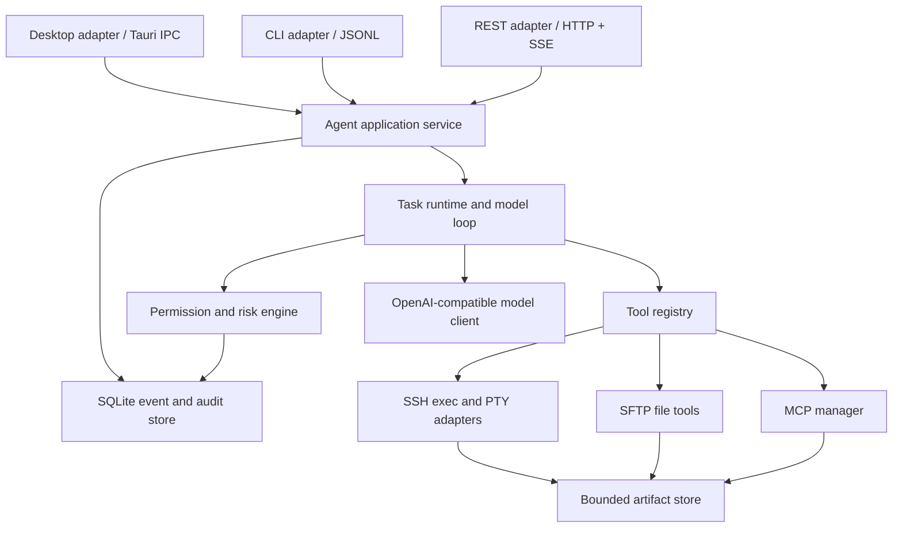
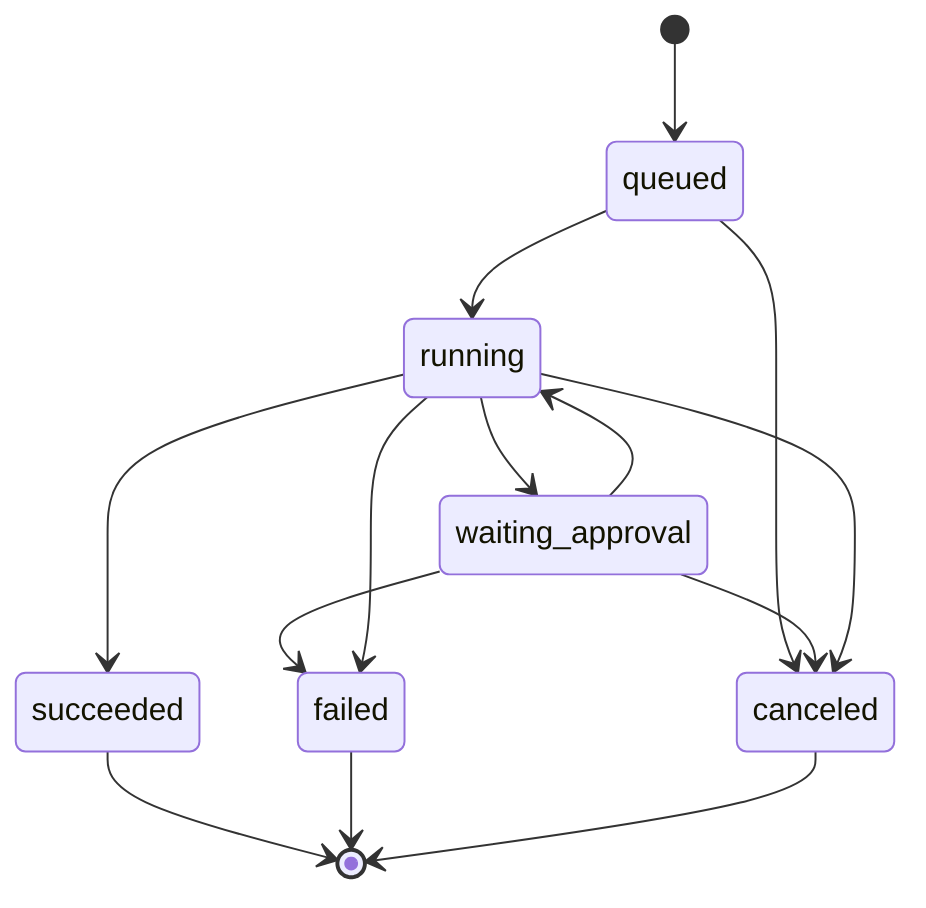

# myterm Linux Agent 功能与技术说明书

> 文档状态：待实施单一事实来源
> 目标起始版本：`0.2.0`
> 开发计划：[`linux-agent-development-plan.md`](linux-agent-development-plan.md)
> 研究依据：[`linux-agent-improvement-study.md`](linux-agent-improvement-study.md)

## 1. 文档职责

本文定义 `myterm` 后续 Linux Agent 的产品行为、架构边界、领域类型、工具、权限、事件、CLI、RESTful API、安全要求和验收标准。

文档优先级：

1. Linux Agent 范围以内，以本文为准。
2. 原始 MVP 的终端、SSH、SFTP、配置和安装行为继续以 `myterm-spec/` 为准。
3. 研究报告提供设计理由，不覆盖本文已经确定的契约。
4. 实现需要改变本文契约时，必须先修改本文和开发计划，再改代码。

本文描述的是目标状态。当前 `0.1.4` 仅实现有限 Agent 闭环，不能因本文存在而宣称目标能力已经交付。

## 2. 产品定义

myterm Linux Agent 是嵌入 SSH 客户端的受控运维执行器。用户给出任务后，模型可以读取上下文、选择工具、调用工具、观察结构化结果并继续循环，最终以执行证据和验证证据回答。

### 2.1 目标

- 在 Linux 服务器上可靠执行可观测、可取消的命令和文件操作。
- 让模型基于真实退出码、输出、主机事实和后置验证作出判断。
- 让用户在任何副作用发生前理解目标、风险和影响资源。
- 让桌面端、CLI 和 RESTful API 共享相同行为和安全边界。
- 支持本地 Skill、stdio MCP 和确定性 Hooks，但不能绕过核心策略。
- 为部署排查、服务诊断、日志分析和受控变更提供高效操作体验。

### 2.2 非目标

- 第一阶段不实现通用多 Agent、Agent 团队或并发写服务器。
- 不实现云端 Skill/MCP 市场和自动安装第三方代码。
- 不自动形成包含服务器 secret 或原始终端的长期记忆。
- 不以本地 Windows 沙箱替代远程 Linux 的账号、sudo 和服务器策略。
- 不承诺任意 shell 表达式都可被安全静态分析；无法判断时必须升级审批或拒绝。
- 不把另一个模型的安全判断作为 hard deny 的替代品。

## 3. 术语

| 术语 | 含义 |
|---|---|
| Task | 一次用户目标及其完整 Agent 循环，标识为 `run_id` |
| Step | 一次模型决策轮次 |
| Tool call | 模型请求执行的一个内置或 MCP 工具调用 |
| Job | 一个可独立查询、输出和取消的执行单元，标识为 `job_id` |
| Event | Task 生命周期中的不可变事实，按 `sequence` 排序 |
| Artifact | 超出事件预览限制的完整输出、diff、快照或导出文件 |
| Effect | 操作语义，如 read、write、delete、service、network、identity |
| Resource | 操作影响的主机、路径、服务、软件包、端口或进程 |
| Risk | `low`、`medium`、`high`、`critical` |
| Approval | 用户对一个精确工具调用或本次 Task 精确规则的决定 |
| Evidence | 支撑“执行过”和“目标已满足”的结构化结果 |
| Entry point | `desktop`、`cli` 或 `rest` |

## 4. 用户场景

| ID | 场景 | 完成标准 |
|---|---|---|
| US-01 | 用户让 Agent 检查磁盘空间 | 自动执行只读探针，给出命令退出码、关键证据和结论 |
| US-02 | 用户让 Agent 排查失败服务 | 识别 init 系统，检查状态与日志，不在无确认时重启服务 |
| US-03 | 用户让 Agent 修改配置并重载 | 审批展示 diff 和影响服务；写入、语法检查、reload、状态验证形成完整证据链 |
| US-04 | 用户运行耗时部署命令 | 可看实时 stdout/stderr、转为后台、查询状态和取消 |
| US-05 | 用户关闭并重开 Agent 面板 | Task 状态和事件可恢复，不重复执行工具 |
| US-06 | 用户通过 CLI 发起任务 | JSONL 与桌面事件语义一致，退出码反映最终状态 |
| US-07 | 系统通过 REST 发起任务 | 幂等创建、SSE 续传、认证审批和取消全部可审计 |
| US-08 | 模型连续重复同一失败调用 | 第三次调用被循环保护暂停，不继续消耗步骤或破坏系统 |

## 5. 功能需求

### 5.1 任务与循环

| ID | 需求 |
|---|---|
| FR-TASK-001 | 系统必须为每次任务生成 UUID `run_id`，并在模型请求前持久化任务。 |
| FR-TASK-002 | Task 必须记录入口、调用方、AI profile、目标、权限模式、创建/更新时间和当前状态。 |
| FR-TASK-003 | Agent 必须执行“模型决策 -> 工具审批 -> 工具执行 -> 结果持久化 -> 继续模型”的循环。 |
| FR-TASK-004 | 工具成功只能由工具结构化结果决定，模型文字不得改变工具结果。 |
| FR-TASK-005 | Task 必须支持用户取消，取消信号传播到模型请求、审批等待和运行中 Job。 |
| FR-TASK-006 | 最大步骤数默认 8，可配置 1-32；达到上限使用独立完成原因。 |
| FR-TASK-007 | 相同工具名与规范化参数连续出现 3 次时触发循环保护。 |
| FR-TASK-008 | 同一 Task 的状态、事件和审批必须可在 UI/CLI/API 断开后恢复。 |
| FR-TASK-009 | 默认全局同时运行 1 个 Agent Task，其他 Task 进入 `queued`；后续最大并发只能显式配置。 |
| FR-TASK-010 | 同一 SSH session 同时只允许一个有副作用 Task，避免并发写冲突。 |

### 5.2 工具与执行

| ID | 需求 |
|---|---|
| FR-EXEC-001 | 一般非交互命令必须使用 `remote_exec`，不得用 PTY 快照推断完成。 |
| FR-EXEC-002 | `remote_exec` 必须返回 exit code、stdout、stderr、耗时、终止原因和截断信息。 |
| FR-EXEC-003 | stdout/stderr 必须增量发布并落入受限 Artifact；模型只接收有限预览。 |
| FR-EXEC-004 | 执行必须支持超时、取消和 SSH 断线，并产生互不混淆的结果。 |
| FR-EXEC-005 | `terminal_send` 只用于明确的交互式 PTY 场景，仍进入相同审批和审计。 |
| FR-EXEC-006 | 后台 Job 必须支持状态、输出游标和取消；应用重启后不可重连的 Job 标记为 `lost`。 |
| FR-EXEC-007 | 工具错误必须使用稳定错误码，不得只返回自由文本。 |
| FR-EXEC-008 | 所有工具在执行前进入策略引擎，执行后写入事件和审计。 |

### 5.3 权限与验证

| ID | 需求 |
|---|---|
| FR-POL-001 | 权限模式必须为 `read_only`、`confirm`、`task_grant`；默认 `confirm`。 |
| FR-POL-002 | 规则优先级必须为 `deny > ask > allow`，hard deny 不得被任何 allow 覆盖。 |
| FR-POL-003 | 策略输入必须包含入口、调用方、主机、环境、用户、工具、命令结构、effect、resource 和 risk。 |
| FR-POL-004 | 无法解析或分类的命令使用 `unknown/high`，不得自动执行。 |
| FR-POL-005 | root 和 production 环境不得使用宽泛 `task_grant`；critical 操作逐次确认或拒绝。 |
| FR-POL-006 | 审批只支持 `approve_once`、`allow_rule_for_run`、`deny`，5 分钟默认过期。 |
| FR-POL-007 | 运行级 allow 规则随 Task 终止，不写入全局默认配置。 |
| FR-POL-008 | 有副作用任务必须记录后置条件并验证；缺少验证不能进入成功终态。 |
| FR-POL-009 | Skill、Hook、MCP 和模型提示都不能覆盖策略结果。 |

### 5.4 持久化与审计

| ID | 需求 |
|---|---|
| FR-AUD-001 | Task、Event、Approval、Job、Evidence 和 Artifact 元数据必须持久化到 SQLite。 |
| FR-AUD-002 | Event 必须先持久化成功再发送给订阅方。 |
| FR-AUD-003 | 每个 Task 的 sequence 从 1 单调递增且唯一。 |
| FR-AUD-004 | 审计必须记录入口、调用方、主机、用户、模型、工具、脱敏参数、审批、结果和时间。 |
| FR-AUD-005 | 密码、API Key、私钥、passphrase、认证 header 和完整敏感环境变量不得进入数据库、日志或 Artifact。 |
| FR-AUD-006 | 用户必须能够查看、导出和删除 Task 历史；删除操作本身记录审计摘要。 |
| FR-AUD-007 | 默认保留 30 天，固定 Task 不自动清理；默认总 Artifact 配额 1GiB。 |

### 5.5 多入口

| ID | 需求 |
|---|---|
| FR-ENTRY-001 | Desktop、CLI 和 REST 必须调用同一个 Agent 应用服务。 |
| FR-ENTRY-002 | 三种入口必须共享 Task 状态、事件、审批、取消、错误码和审计。 |
| FR-ENTRY-003 | CLI/REST 不得直接连接 SSH 或启动 shell 绕过应用服务。 |
| FR-ENTRY-004 | Canonical JSON 使用 `snake_case`；现有 Tauri IPC 可由适配器保持 camelCase 兼容。 |
| FR-ENTRY-005 | 所有外部 JSON 契约必须包含 schema 或 API 版本。 |

### 5.6 Linux 运维工具

| ID | 需求 |
|---|---|
| FR-OPS-001 | 系统必须采集带时间戳和有效期的主机事实，用于选择发行版、init 和包管理器行为。 |
| FR-OPS-002 | 系统必须提供结构化文件读取、搜索、写入、patch、上传和下载工具，减少 shell 拼接。 |
| FR-OPS-003 | 文件修改必须使用 expected hash、diff、临时文件、原子替换和 readback，敏感路径进入更高风险。 |
| FR-OPS-004 | 标准 runbook 必须定义确定性采集步骤、证据字段、停止规则和失败路径，模型只承担需要判断的步骤。 |

### 5.7 CLI 与 RESTful API

| ID | 需求 |
|---|---|
| FR-CLI-001 | CLI 必须提供 Task 创建、状态、事件、审批和取消命令，并支持 human 与 JSONL 输出。 |
| FR-CLI-002 | CLI 退出码、stderr/stdout 和 `Ctrl+C` 行为必须稳定且可由黑盒测试验证。 |
| FR-CLI-003 | 非交互 CLI 遇到审批时必须返回可恢复状态，不得自动提升权限。 |
| FR-API-001 | REST 必须提供版本化 Task、Event、Approval、Cancel 和 Artifact 资源接口。 |
| FR-API-002 | REST Event 必须通过可按 sequence 恢复的 SSE 提供，断线不得触发重复执行。 |
| FR-API-003 | REST 创建、审批和取消必须幂等，并受认证、RBAC、profile 白名单、速率和并发限制。 |
| FR-API-004 | REST 默认只监听 loopback；非 loopback 必须显式启用 TLS 和远程访问。 |

### 5.8 扩展层

| ID | 需求 |
|---|---|
| FR-EXT-001 | Skill 必须支持摘要发现、按需正文/附件加载、权限元数据、内容 hash 和信任状态。 |
| FR-EXT-002 | MCP 必须在 Task 内复用连接，提供超时、健康、有限重连、日志和按工具权限。 |
| FR-EXT-003 | Hook 必须使用明确生命周期，允许追加上下文、deny、ask 和验证建议，但不能降低策略结果。 |
| FR-EXT-004 | 上下文压缩必须保留 Task 目标、主机、批准规则、关键证据、运行 Job 和未完成验证。 |

### 5.9 内核效率

| ID | 需求 |
|---|---|
| FR-EFF-001 | Agent、SQLite worker、MCP、REST 和主机事实刷新必须按需启动；功能未启用时不得产生常驻子进程、监听端口或忙轮询。 |
| FR-EFF-002 | Desktop、CLI 和 REST 必须复用同一 Tokio runtime、HTTP client、模型 client、SSH 实现和事件存储，不得复制执行内核。 |
| FR-EFF-003 | 命令输出必须流式写入有界缓冲和 Artifact，内存占用不得随完整 stdout/stderr 线性增长。 |
| FR-EFF-004 | 新依赖必须记录用途、license、MSRV、压缩体积、运行内存和可替代方案；不得嵌入第二个浏览器或语言运行时。 |
| FR-EFF-005 | 每个里程碑必须测量体积、内存、空闲 CPU、启动、事件和长输出性能，超过预算即阻止发布。 |
| FR-EFF-006 | CLI/REST 不得安装默认自启动的常驻系统服务；headless Agent 只能由用户显式启动或按任务临时启动，并在安全空闲后退出。 |

## 6. 总体架构



### 6.1 模块边界

目标 Rust 模块：

```text
src-tauri/src/agent/
  application.rs       # 创建、查询、审批、取消 Task
  runtime.rs           # 模型与工具循环
  domain.rs            # Agent 领域类型与状态转换
  events.rs            # 事件构造与发布
  store.rs             # SQLite repository
  policy/
    mod.rs             # 规则求值
    command.rs         # shell 解析与 effect/resource 提取
    defaults.rs        # hard deny 和默认规则
  tools/
    mod.rs             # 注册表和统一 Tool trait
    terminal.rs        # terminal_context / terminal_send
    remote_exec.rs     # SSH exec channel
    jobs.rs            # job status/output/cancel
    files.rs           # 文件工具
    session.rs         # session_info / host facts
  mcp.rs               # MCP 生命周期和适配
  skills.rs            # Skill 发现和按需加载
  hooks.rs             # 生命周期 Hooks
```

在 `0.2.x` 中保持为应用内部模块，先验证边界。开发 CLI 前，如果 Tauri 类型仍渗透到应用服务，必须提取 workspace crate `myterm-agent-core`。是否提取由依赖检查决定，不能为了形式提前拆 crate。

### 6.2 依赖规则

- adapter 只能依赖 application API 和 canonical domain 类型。
- runtime 不得依赖 React、Tauri Channel、CLI 参数或 HTTP 类型。
- tool 实现不能自行弹审批；它只声明 effect/resource/risk 并接收策略决定。
- policy 不能执行命令或调用模型。
- store 不包含业务状态推断，只执行事务、查询和迁移。
- secret 只能由 credential vault 在执行边界按引用解析，不能进入 Task 请求对象。
- Agent 相关模块不得创建第二个异步 runtime、第二套 SSH client 或重复 HTTP 连接池。
- SQLite worker、MCP child、REST listener 和定时刷新器必须有明确 owner、启动条件、停止条件和资源上限。

## 7. 领域模型与状态

### 7.1 Task 请求

```json
{
  "schema_version": 1,
  "prompt": "检查 nginx 失败原因并给出结论",
  "ai_profile_id": "uuid",
  "target": {
    "kind": "profile",
    "profile_id": "uuid"
  },
  "permission_mode": "confirm",
  "max_steps": 8,
  "entry_point": "desktop"
}
```

`target.kind` 支持：

- `existing_session`：必须带 `session_id`，Task 不拥有连接生命周期。
- `profile`：必须带 `profile_id`，应用服务按保存凭据连接；Task 结束时释放自己创建的连接。

请求不接受密码、API Key、私钥内容或任意 vault ref。服务从已保存的 profile 解析凭据引用。

### 7.2 Task 状态机



终态不得再次转为运行态。继续或重试必须创建新的 `run_id`，并记录 `parent_run_id`。

`finish_reason` 与状态分开：

| Task 状态 | finish_reason 示例 |
|---|---|
| `succeeded` | `completed` |
| `failed` | `verification_failed`、`permission_denied`、`approval_expired`、`step_limit`、`loop_detected`、`model_error`、`connection_lost`、`internal_error` |
| `canceled` | `user_canceled`、`shutdown_canceled` |

### 7.3 Job 状态

`queued -> running -> succeeded | failed | canceled | timed_out | lost`。

Job 在 Task 内唯一并关联一个 tool call。前台 Job 完成后 Agent 循环继续；后台 Job 立即返回 `job_id`，模型必须通过状态工具观察它。第一版后台 Job 只在 myterm 进程存活期间可控制；应用异常退出后仍无法确认的远程进程标记 `lost`，不得报告已停止。

## 8. 事件协议

### 8.1 Envelope

CLI JSONL、REST SSE 和 SQLite 使用同一 canonical event：

```json
{
  "schema_version": 1,
  "event_id": "uuid",
  "run_id": "uuid",
  "sequence": 12,
  "event_type": "tool.finished",
  "created_at": "2026-08-09T04:00:00.000Z",
  "payload": {
    "call_id": "call_123",
    "tool_name": "remote_exec",
    "job_id": "uuid",
    "success": false,
    "error_code": "exit_nonzero"
  }
}
```

### 8.2 事件类型

| 事件 | 关键 payload |
|---|---|
| `task.created` | target 摘要、入口、权限模式 |
| `task.state_changed` | previous、current、reason |
| `model.started` / `model.finished` | step、model、finish reason、token 量级 |
| `tool.requested` | call_id、tool、脱敏参数摘要 |
| `policy.decided` | decision、risk、effects、resources、reason codes |
| `approval.requested` / `approval.resolved` | approval_id、decision、expires_at、actor |
| `job.started` / `job.output` / `job.finished` | job_id、stream、offset、exit/termination |
| `tool.finished` | success、error_code、result preview、artifact refs |
| `evidence.recorded` | claim、kind、source call、passed |
| `context.compacted` | before/after token 量级、保留项摘要 |
| `task.completed` | state、finish_reason、steps、verification summary |

事件 payload 不保存完整模型 prompt、完整命令输出或 secret。完整输出进入 Artifact，事件保存受限预览和引用。

Task 历史只持久化脱敏后的用户任务文本和最终答复。模型的完整 message context、原始系统提示和未脱敏用户输入仅存在于运行内存，不用于长期记忆；应用异常退出后可以恢复事件和终态，但不会从中断点继续原模型对话。用户重试会创建带 `parent_run_id` 的新 Task。

## 9. Agent 循环

规范流程：

1. 校验请求、目标 profile 和权限模式。
2. 持久化 Task 与 `task.created`。
3. 建立或绑定 session，读取主机事实和启用的 Skill/MCP 目录。
4. 组装最小系统上下文和工具目录。
5. 请求模型并持久化 model 事件。
6. 没有工具调用时，检查是否存在未完成 Job、未满足后置条件或缺失证据。
7. 对每个工具调用规范化参数并计算重复签名。
8. 工具声明 effect/resource/risk，策略引擎返回 deny/ask/allow。
9. deny 返回结构化错误；ask 持久化审批并进入 `waiting_approval`；allow 创建 Job。
10. 工具输出先写 Artifact/Event，再将受限结果返回模型。
11. 达到完成条件时写最终答复和终态；异常和取消同样写终态。

模型不能直接改变 Task 状态，不能直接写数据库，也不能请求“忽略权限”。

## 10. 内置工具

### 10.1 `remote_exec`

请求：

```json
{
  "command": "systemctl status nginx --no-pager",
  "cwd": "/var/www/app",
  "timeout_ms": 120000,
  "mode": "foreground",
  "max_output_bytes": 10485760
}
```

约束：

- `command` 必填，UTF-8，最大 32KiB。
- `cwd` 可选，必须是远程绝对路径并进入策略资源分析。
- `timeout_ms` 默认 120,000，范围 1,000-1,800,000。
- `mode` 为 `foreground` 或 `background`。
- `max_output_bytes` 默认 10MiB，单 Job 最大 50MiB。
- 第一版不接受任意 secret 环境变量；需要 secret 的命令必须使用服务器已有配置或后续受控 vault 注入机制。
- 通过 SSH exec channel 执行，不分配 PTY。

结果：

```json
{
  "job_id": "uuid",
  "state": "failed",
  "exit_code": 3,
  "signal": null,
  "started_at": "2026-08-09T04:00:00.000Z",
  "duration_ms": 842,
  "stdout_preview": "...",
  "stderr_preview": "...",
  "stdout_artifact_id": "uuid",
  "stderr_artifact_id": null,
  "stdout_truncated": true,
  "stderr_truncated": false,
  "termination": "exit"
}
```

`termination` 为 `exit`、`signal`、`timeout`、`canceled`、`connection_lost` 或 `output_limit`。非零 exit code 是工具执行完成但命令失败，不能伪装为传输错误。

### 10.2 Job 工具

- `job_status(job_id)`：返回状态、耗时、exit/termination 和最新 offset。
- `job_output(job_id, stream, offset, limit)`：分页读取 stdout/stderr，单次最大 64KiB。
- `job_cancel(job_id)`：幂等取消；终态 Job 返回原状态。

### 10.3 PTY 与上下文工具

- `terminal_context(lines)`：保留，最大 500 行，只读。
- `terminal_send(command, newline)`：保留，默认 high risk；只用于交互场景，结果声明“已发送”而不是“执行成功”。
- `session_info()`：增加环境标签、当前用户、root 状态和主机事实摘要。

### 10.4 文件工具

- `file_stat(path)`、`file_read(path, offset, limit)`、`file_search(path, pattern, limits)`。
- `file_write(path, content, expected_hash)` 和 `file_patch(path, patch, expected_hash)` 使用乐观锁、防止覆盖外部变化。
- 写入流程为读取元数据、生成 diff、审批、临时文件、权限/owner 处理、原子替换、readback。
- symlink、敏感路径、二进制和超限文件按策略升级或拒绝。

### 10.5 主机事实

`host_facts()` 返回：发行版、版本、内核、架构、hostname、当前用户、shell、init、包管理器、SELinux/AppArmor、容器、可用命令和采集时间。默认缓存 10 分钟，用户可强制刷新只读事实。

## 11. 权限与风险

### 11.1 权限模式

| 模式 | 行为 |
|---|---|
| `read_only` | 只允许策略确认的低风险读取；所有写入、副作用和未知操作 deny |
| `confirm` | 低风险读取可自动执行；其他操作按规则 ask 或 deny |
| `task_grant` | 用户可在本次 Task 内批准精确规则；Task 结束即清除 |

旧 `full_access` 配置迁移为 `confirm`。不得静默保留自动执行语义。

### 11.2 Effect 与风险

Effect：`read`、`write`、`delete`、`execute`、`service`、`package`、`network`、`identity`、`scheduler`、`power`、`unknown`。

风险基线：

| 风险 | 示例 | 默认 |
|---|---|---|
| low | `uname`、`df`、读取普通日志、状态查询 | allow |
| medium | 写用户目录文件、启动非关键后台任务 | ask |
| high | 安装包、服务 restart、写 `/etc`、修改端口规则 | ask once，不允许宽泛规则 |
| critical | SSH/sudoers/账号、防火墙全局规则、关机重启、块设备 | 每次 ask 或 deny |

### 11.3 Hard deny

默认 hard deny 至少包括：

- 对 `/`、`/boot`、挂载根或无法限定目标的递归删除。
- `mkfs`、格式化文件系统、向块设备写 `dd` 或等价操作。
- fork bomb 和明确的资源耗尽表达式。
- 关闭审计、删除 myterm 审计证据或修改 Agent 自身策略以完成当前 Task。
- 从未验证来源下载后直接 pipe 到 shell。
- 在无法解析目标资源时执行不可逆 critical 操作。

用户不能在普通 UI、CLI 参数或 REST 请求中覆盖 hard deny。后续若提供管理员策略文件，也只能增加 deny，不能删除内置 hard deny。

### 11.4 root 与环境标签

- profile 必须支持 `development`、`staging`、`production` 环境标签，默认未标记按 `production` 保守处理。
- root session 持续显示高风险状态。
- root/production 禁止创建覆盖 high/critical 的运行级 allow 规则。
- 推荐使用独立非 root Agent 账号和受限 `sudo -n`；说明书不声称客户端可沙箱隔离远程 root。

### 11.5 审批对象

审批卡必须显示：主机、环境、用户、工具、规范化命令摘要、effects、resources、risk、原因、有效期和可选精确规则。

审批响应：

```json
{
  "decision": "approve_once",
  "approval_id": "uuid",
  "expected_version": 1
}
```

审批使用乐观版本，重复或过期响应返回 conflict，不重新执行工具。

## 12. 证据与完成

Evidence 类型：

- `execution`：命令、文件或 MCP 工具确实执行及其结果。
- `verification`：任务目标的后置条件是否满足。
- `change`：修改前后 hash、diff、服务或包状态。
- `rollback`：可用备份、恢复命令或明确不可回滚说明。

有副作用 Task 成功条件：

1. 所有关键 Tool call 有确定终态。
2. 所有声明的后置条件有 verification evidence。
3. verification evidence 全部通过。
4. 没有仍在运行且影响目标的未托管 Job。
5. 最终答复引用关键证据，不把“命令发送”表述为“命令成功”。

验证失败时 Task 为 `failed / verification_failed`，UI 可以同时说明变更可能已经发生以及建议的回滚动作。

## 13. 持久化与 Artifact

### 13.1 SQLite

数据库位于应用数据目录，不进入便携包程序目录之外的未知位置。核心表：

- `schema_migrations`
- `agent_tasks`
- `agent_events`
- `agent_tool_calls`
- `agent_approvals`
- `agent_jobs`
- `agent_evidence`
- `agent_artifacts`
- `api_idempotency_keys`

每个状态转换、事件 sequence 和审批创建必须在一个事务中完成。SQLite 访问放入专用 worker 或 `spawn_blocking`，不能阻塞 Tokio 异步执行线程。

### 13.2 Artifact

- 文件位于应用数据目录下按 `run_id` 隔离的目录。
- 文件名由系统生成，不使用模型或远端路径作为本地文件名。
- 默认单 Job 50MiB、全部 1GiB；超限停止捕获并标记，不无限写盘。
- 文件权限仅当前用户可读；导出由用户显式触发。
- 清理先删除文件，再在事务中更新元数据；失败可重试，不留下指向他人文件的路径。

### 13.3 脱敏

脱敏在日志、事件、Artifact 写入和 UI 展示前执行。至少识别：已知 vault secret、Authorization header、常见 API key/token 格式、私钥块、密码参数和敏感环境变量。脱敏不能作为保存 secret 的许可，工具设计仍应避免接收明文 secret。

## 14. Desktop Agent 控制台

### 14.1 固定上下文

顶部显示服务器名称、环境标签、host、用户、root 状态、cwd、权限模式和 Task 状态。用户切换活动终端不能静默改变运行中 Task 的 target。

### 14.2 Task 时间线

- 展示模型步骤、工具、风险、参数摘要、审批、执行、验证和最终状态。
- stdout/stderr 分开，默认只看预览，可打开 Artifact。
- 显示 exit code、termination、耗时、截断、重试和循环保护。
- 后台 Job 提供状态、查看输出和取消按钮。
- Task 历史支持筛选服务器、状态和时间，支持恢复、导出和删除。

### 14.3 审批交互

按钮为“拒绝”“仅本次允许”“本次任务允许此精确规则”。high/critical、root/production 不显示不适用的规则授权选项。审批过期后按钮失效并显示原因。

### 14.4 最终状态

必须区分：完成、验证失败、权限阻止、审批过期、步骤上限、循环保护、用户取消、连接中断和内部错误。

## 15. CLI 说明

### 15.1 命令

```text
myterm agent run --server <profile-id-or-name> --task <text> [--permission <mode>] [--output human|jsonl]
myterm agent serve [--idle-timeout <seconds>]
myterm task status <run-id> [--output human|json]
myterm task events <run-id> [--after <sequence>] [--follow]
myterm task approve <run-id> <approval-id> --decision approve-once|allow-rule-for-run|deny
myterm task cancel <run-id>
```

`--task -` 从 stdin 读取。CLI 不接受密码、API Key 或私钥内容参数；敏感任务文本也应通过 stdin 输入，避免进入进程列表和 shell history。重名 server profile 必须报错并要求 ID。

CLI 优先连接已运行的 desktop Agent application service。没有可用实例时，`agent run` 可以启动同一可执行文件的临时 headless service；不得注册 Windows 自启动服务。`agent serve` 由用户显式启动，默认空闲 300 秒退出；存在运行中或等待审批的 Task、REST listener 或尚未清理的 Job 时不计为空闲。

### 15.2 JSONL

- 第一行从 `task.created` 或请求游标后的第一条 Event 开始。
- 每行一个完整 Event envelope，不混入进度条、颜色控制码或非 JSON 文本。
- 诊断信息写 stderr，Event 写 stdout。
- `--follow` 断线后使用最后 sequence 恢复。

### 15.3 退出码

| Code | 含义 |
|---|---|
| 0 | Task succeeded |
| 2 | CLI 参数或用法错误 |
| 10 | Task failed |
| 11 | Task canceled |
| 12 | Task waiting approval，非交互调用停止等待 |
| 13 | Permission denied |
| 14 | 本机 Agent 服务或目标连接不可用 |
| 15 | 协议/schema 不兼容 |

`Ctrl+C` 第一次请求 Task 取消并等待最多 5 秒；第二次仅终止 CLI 客户端。客户端退出不能把远端 Job 伪报为已取消。

## 16. RESTful API 说明

### 16.1 服务边界

- 默认关闭；启用后默认监听 `127.0.0.1` 随机或用户指定端口。
- 非 loopback 监听必须配置 TLS、认证和显式 `allow_remote=true`，否则拒绝启动。
- 禁止匿名远程访问，禁止 cookie session，默认不启用 CORS。
- API 使用 `Authorization: Bearer`，token 至少包含 256 bit 随机熵，只显示一次，服务端只保存 hash 并使用恒定时间比较；token 禁止出现在 URL、日志和错误消息中。
- API 只接受已保存 profile ID，不接受 SSH secret。

### 16.2 角色

| 角色 | 权限 |
|---|---|
| `viewer` | 查询 Task 和 Event |
| `operator` | 创建 read_only/confirm Task、取消自己的 Task |
| `approver` | 审批允许的 profile 和 risk 范围 |
| `admin` | 管理 API 配置、token、角色和 profile 白名单；仍不能覆盖 hard deny |

### 16.3 端点

| Method | Path | 行为 |
|---|---|---|
| POST | `/v1/tasks` | 创建 Task；支持 `Idempotency-Key` |
| GET | `/v1/tasks/{run_id}` | 查询 Task 快照 |
| GET | `/v1/tasks/{run_id}/events` | SSE；支持 `Last-Event-ID` 或 `after` |
| POST | `/v1/tasks/{run_id}/approvals/{approval_id}` | 幂等提交审批 |
| POST | `/v1/tasks/{run_id}/cancel` | 幂等取消 |
| GET | `/v1/tasks/{run_id}/artifacts/{artifact_id}` | 受权下载 Artifact |
| GET | `/v1/health` | 不泄露 profile、模型或 secret 的健康状态 |

### 16.4 HTTP 语义

- 创建成功：`202 Accepted`，返回 Task 快照与事件 URL。
- 幂等键重复且 body 相同：返回原 Task；body 不同：`409 Conflict`。
- SSE `id` 等于 sequence，`event` 等于 event_type，`data` 为完整 envelope。
- 审批过期/版本冲突：`409`；未认证：`401`；越权：`403`；不存在：`404`；限流：`429`。
- 每个响应带 `X-Request-Id`，并写入审计。
- OpenAPI 3 文档随服务发布并在测试中校验。

## 17. Skill、MCP 与 Hooks

### 17.1 Skill v2

`SKILL.md` frontmatter 目标字段：

```yaml
name: Linux Service Triage
description: Diagnose systemd service failures
platforms: [linux]
allowed_tools: [host_facts, remote_exec, file_read]
risk: read_only
model_invocable: true
```

- 初始上下文只注入名称、描述和入口说明；正文及附件按需加载。
- 目录 canonicalize、忽略 symlink、文件/总大小限制继续保留。
- Skill 脚本必须注册成工具并进入策略，不允许系统提示直接执行本地脚本。
- UI 显示来源路径、内容 hash、启用状态和信任状态。

### 17.2 MCP

- 每个 Task 复用已初始化客户端，Task 结束后有序关闭。
- 启动、list tools、call tool 分别有超时；崩溃可有限重连。
- MCP 工具名、server、schema hash 和调用结果进入审计。
- MCP annotation 只能提升风险或辅助展示，不能降低本地策略风险。
- 工具数量超过上下文阈值时，模型先搜索目录再加载 schema。

### 17.3 Hooks

第一阶段事件：`SessionStart`、`PreToolUse`、`PostToolUse`、`ToolFailure`、`PreCompact`、`Stop`。

Hook 可返回追加上下文、deny、ask 或验证建议。Hook 的 allow 不能覆盖 policy ask/deny；Hook 超时按失败记录并采用更保守结果。Hook stdout/stderr 受输出与脱敏限制。

## 18. 错误模型

稳定错误码至少包括：

```text
invalid_input
not_found
conflict
unauthorized
forbidden
permission_denied
approval_required
approval_expired
timeout
canceled
connection_lost
exit_nonzero
output_limit
loop_detected
step_limit
model_error
mcp_error
storage_error
rate_limited
internal_error
```

错误对象包含 `code`、用户可读 `message`、可选 `retryable`、`run_id`、`call_id` 和脱敏 `details`。内部错误的堆栈和原始协议内容不通过 UI/CLI/API 返回。

## 19. 非功能要求

### 19.1 安全

- Credential vault 仍是 secret 的唯一持久来源。
- 非 HTTPS AI endpoint 必须持续显示风险，不在日志中记录 header/body。
- 远程 root 的实际安全依赖服务器最小权限账号、受限 sudo 和审计。
- 新依赖必须记录用途、license、MSRV、包体积和维护状态。

### 19.2 可靠性

- 每个 Task 必有终态；应用启动时修复遗留 `running/waiting_approval` 为可解释失败或取消状态。
- Event 持久化与状态更新保持事务一致。
- 相同幂等请求和重复审批不得触发重复执行。
- 取消不能宣称超出系统实际能确认的结果。

### 19.3 性能与容量

基线测量使用 release 构建、同一台 Windows 验证机、相同 WebView2 版本。空闲指标在启动 45 秒后连续采样 60 秒并取中位数；每份发布报告同时记录原生主进程和完整进程组，禁止只选择较小数字。

| 指标 | 发布预算 | 当前已知基线/说明 |
|---|---|---|
| 原生主进程空闲 private working set | `<= 12MiB` | `0.1.4` 为 `6.69MB` |
| 完整 desktop/WebView2 进程组空闲 private working set | `< 80MiB` | `0.1.4` 为 `93.01MB`，当前未达标，仍是发布阻断项 |
| headless Agent service 空闲 private working set | `<= 20MiB` | C1 首次实现时建立基线 |
| 空闲 CPU | desktop 进程组及 headless service 分别 `<= 1%` | 无 Task、无传输、无用户输入时测量 |
| NSIS 安装包和便携 ZIP | 各 `< 20MiB` | 任何单里程碑压缩体积增加 `> 1MiB` 必须 ADR |
| 启动时间 | 相比 `0.1.4` 中位数不得回退 `> 10%` | A0 先补可重复基线；headless help/status 另测 |
| 10MiB 命令输出 | 吞吐 `>= 5MiB/s`，UI 无可见卡死，进程组峰值增量 `<= 25MiB` | stdout/stderr 进入 Artifact，不整体驻留内存 |
| Event 发布 | 本地持久化后到订阅方 p95 `< 250ms` | 不含模型和远端网络延迟 |
| Event 游标查询 | 10,000 条内 p95 `< 100ms` | 在发布硬件和数据库规模说明中记录 |

实现约束：

- 每个运行中 Job 的 stdout/stderr 内存窗口合计默认不超过 `2MiB`；更早内容只保留 Artifact 和游标。
- `job.output` 事件按最多 50ms 或累计 64KiB 合并，避免逐字节/逐行写 SQLite 和跨 IPC。
- 模型单次工具结果默认不超过 12,000 字符，使用首尾预览和 Artifact 引用。
- REST 关闭时没有 listener；MCP 只在使用它的 Task 生命周期内存在；主机事实不得以短周期轮询刷新。
- SQLite 在首次 Agent/历史/API 操作时启动专用 worker，禁止在 Tokio worker 上执行阻塞查询。
- 禁止为 CLI 或 REST 引入第二个 SSH 栈、第二个模型客户端、第二个 Tokio runtime、内嵌 Node/Python 或额外 WebView。
- 任一预算未达标时不得把里程碑标记为可发布。确因 OS WebView2 基线无法达到的指标必须向用户报告实测和原因，并取得明确决策，不能静默修改预算。

### 19.4 可观测性

- 记录 Task 数、状态、模型耗时、审批等待、工具耗时、错误类别、Event/Artifact 大小。
- 默认日志不记录 prompt、命令完整输出或 secret。
- REST request ID、CLI invocation ID 和 desktop Task 均能关联 run_id。

### 19.5 可访问性与界面

- 风险不能只用颜色表达，必须有文本和图标。
- 长命令、长路径、stdout/stderr 和错误信息不能撑破面板或遮挡操作。
- 审批按钮顺序与语义在三主题、桌面和窄窗口保持一致。

## 20. 验收矩阵

| 能力 | 必测情况 | 主要需求 |
|---|---|---|
| Task 状态 | 正常、失败、取消、审批、步骤上限、崩溃恢复 | FR-TASK-001..010 |
| 远程执行 | 0/非0退出、stderr、signal、超时、长输出、断线 | FR-EXEC-001..008 |
| 权限 | 管道、重定向、命令替换、root、production、hard deny | FR-POL-001..009 |
| 审计 | 审批关联、事件顺序、脱敏、删除、保留期 | FR-AUD-001..007 |
| Desktop | 风险、审批、Job、Artifact、历史、窄窗口、三主题 | US-01..05 |
| Linux 运维工具 | 发行版、init、文件原子写入、symlink、runbook 失败路径 | FR-OPS-001..004 |
| CLI | human/JSONL、游标、退出码、Ctrl+C、无交互审批 | US-06、FR-ENTRY-001..005、FR-CLI-001..003 |
| REST | auth/RBAC、幂等、SSE 续传、限流、TLS、OpenAPI | US-07、FR-ENTRY-001..005、FR-API-001..004 |
| 扩展 | MCP 崩溃、Skill 按需、Hook deny、上下文压缩 | FR-EXEC-008、FR-POL-009、FR-EXT-001..004 |
| 内核效率 | 懒启动、有界输出、无默认 daemon、内存/CPU/体积/启动回归 | FR-EFF-001..006 |

发布前必须把每个需求 ID 映射到至少一个自动测试或明确的人工验收记录。缺少映射的需求不能标记完成。

## 21. 实施时必须形成的技术决策记录

以下实现选择在对应里程碑开始前写 ADR，并更新本文登记结果：

1. Bash 解析库：正确性、维护状态、license、MSRV、二进制体积和 fuzz 能力。
2. SQLite 访问方式：`rusqlite` 版本、bundled 策略、worker 模型和迁移工具。
3. CLI 参数库与本机 Agent 服务通信协议。
4. REST 框架、TLS 实现、token 格式和 OpenAPI 生成方式。
5. Artifact secret 扫描和脱敏算法的性能边界。

ADR 可以改变具体依赖，不能降低本文的行为和安全要求。
