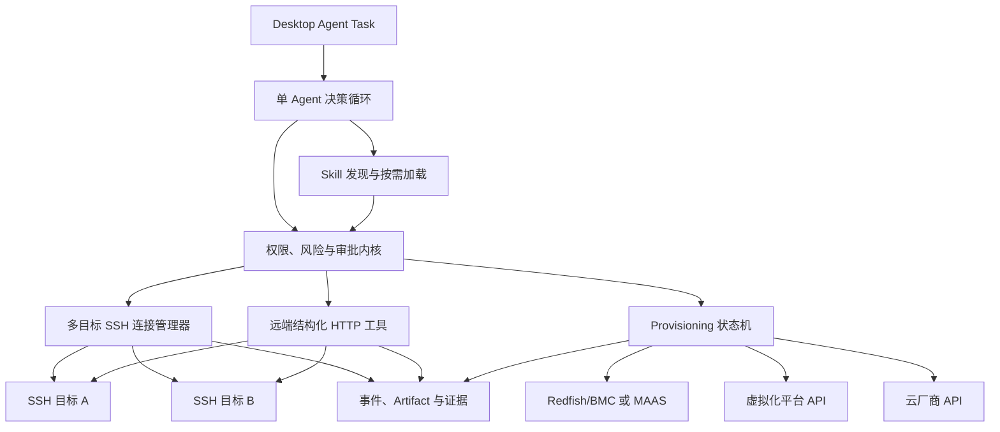
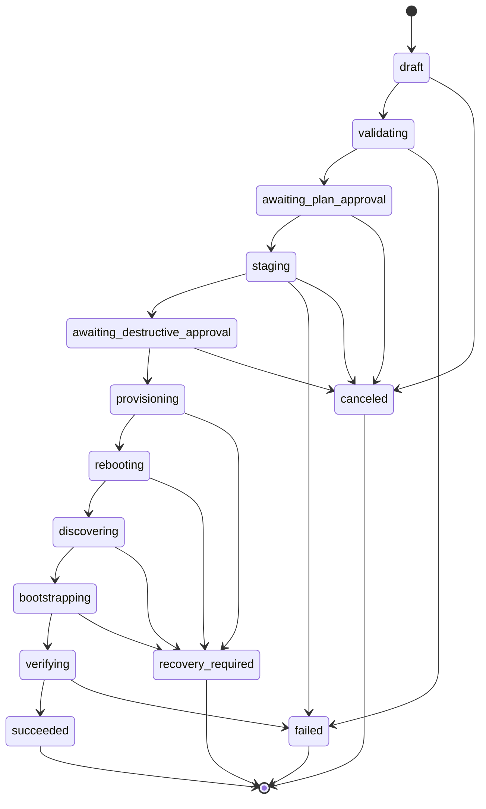

# myterm 多 SSH 协同与 Skill 驱动 OS 安装方案

> 当前实现使用官方 DeepSeek Harness 的 Agent Loop，并通过 myterm Host MCP 调用多 SSH 工具；OS 安装仍以 Skill 任务方案推进，不提供用户可调循环步数。

> 文档状态：调研结论与目标设计，尚未实现
> 研究日期：2026-08-09
> 适用范围：远端 CLI/REST 运维、多 SSH 协同、Linux/Windows OS 安装与重装
> 关联文档：[`linux-agent-specification.md`](linux-agent-specification.md)、[`linux-agent-development-plan.md`](linux-agent-development-plan.md)

## 1. 结论

myterm Agent 可以支持 OS 安装，但不能把“安装系统”实现成向当前 SSH 终端发送一条命令。系统盘重装会主动破坏当前 OS 和 SSH 通道，真正可靠的控制面必须位于目标 OS 之外：

- 物理服务器使用 Redfish/BMC 虚拟介质、一次性启动项和 PXE/iPXE，或接入 MAAS。
- 虚拟机使用虚拟化平台 API 挂载镜像、设置启动顺序、读取控制台和电源状态。
- 云主机优先使用云厂商的镜像、启动盘和实例生命周期 API。
- SSH 只负责安装前盘点与备份、安装后的引导和验收，不承担系统盘写入期间的主控制链路。

OS 安装必须以一个可恢复的安装 Task 运行，并由本地 `SKILL.md` 触发。Skill 负责说明流程、收集参数、选择适配器和解释结果；实际破坏性操作由类型化 provisioning 工具执行，仍受内核审批、凭据、目标锁、审计和状态机约束。Skill 不是权限边界，也不是第二个 shell 入口。

第一版建议只交付隔离虚拟机实验环境中的 Ubuntu Server Autoinstall。物理机、Windows、RHEL 和生产批量安装在状态机、身份重建和故障恢复通过后分阶段增加。

## 2. 术语纠正

### 2.1 远端 CLI

“支持 CLI”指 Agent 在已保存的 SSH 目标上大量执行 `systemctl`、`journalctl`、`docker`、`kubectl`、包管理器及业务 CLI，并获得结构化退出码、stdout、stderr、超时和审计结果。

它不表示 myterm 提供 headless CLI 产品入口。`0.6.3` 已删除早期的本机 Agent CLI，后续 Linux Agent 只保留桌面入口。

### 2.2 远端 REST

“支持 RESTful”指 Agent 从明确的网络执行来源调用业务或基础设施 HTTP API，例如从应用服务器 A 调用内网控制面，或从观察服务器 B 验证 A 的健康接口。

它不表示 myterm 向外暴露 Agent REST 服务。`0.6.3` 已删除早期的 loopback REST listener、Token、SSE 和 OpenAPI，不规划公网 Agent API。

### 2.3 多 SSH

多 SSH 是一个 Agent Task 同时绑定多个已保存 SSH profile，由同一模型循环和同一权限内核协调。它不是多 Agent，也不要求通用 DAG 编排平台。

### 2.4 OS 安装范围

| 类型 | 示例 | 是否依赖当前 SSH | 第一版处理 |
|---|---|---:|---|
| 软件包安装 | `apt install nginx` | 是 | 继续使用 `remote_exec`，不归入 OS provisioning |
| 发行版原地升级 | Ubuntu 24.04 升级到后续版本 | 是，重启时中断 | 后续独立 Skill，不与整机重装混合 |
| 系统盘重装 | 从 Ubuntu 重装为新的 Ubuntu/RHEL/Windows | 否 | 本方案的 provisioning 状态机 |
| 新机部署 | 空白物理机、VM、云实例安装 OS | 否 | 本方案的 provisioning 状态机 |

## 3. 设计原则

1. **目标必须显式**：多主机任务的每次工具调用必须带 `target_alias`，不能用当前焦点终端作为隐式目标。
2. **执行来源必须显式**：HTTP 和探针记录从本机、某个 SSH 主机或控制面发起，避免网络视角混淆。
3. **副作用默认串行**：跨主机写操作默认一次一个；只读探针可以在有界并发下执行。
4. **条件等待不是固定睡眠**：A 操作后，通过 B 的结构化探针、超时、间隔和成功阈值决定下一步。
5. **安装计划与执行分离**：模型先形成不可变 plan，用户确认精确目标和镜像后才能进入破坏阶段。
6. **Skill 只编排能力**：Skill 可以选择和调用工具，不能扩大允许工具、降低风险或注入任意 secret。
7. **控制面独立于被装 OS**：SSH 消失是预期状态，不得自动判为失败，也不得靠盲目重试恢复。
8. **证据优先**：每个阶段记录控制面状态、镜像摘要、审批、控制台摘要和后置验证。
9. **内核保持轻量**：按使用加载 Skill 和 provider adapter；不内嵌 MAAS、PXE 服务、云 SDK 全家桶或第二个编排引擎。

## 4. 目标架构



Skill 层不直接依赖某个厂商 API。它面向稳定的 provisioning 工具契约，适配器在 Rust 内核或受控 MCP 服务中实现。第一版优先使用 Rust 内核适配器，只有在某个平台已有成熟、可信且可锁定版本的 MCP 服务时才评估 MCP，避免把系统重装的安全边界交给任意第三方进程。

## 5. 多 SSH 任务模型

### 5.1 Task 目标

```json
{
  "prompt": "先更新 A，再从 B 观察 A 的健康接口，成功后继续清理",
  "targets": {
    "app-a": { "kind": "profile", "profile_id": "uuid-a" },
    "observer-b": { "kind": "profile", "profile_id": "uuid-b" }
  },
  "default_target": "app-a",
  "permission_mode": "confirm",
  "max_steps": 16
}
```

- 单主机 Task 可保留 `default_target` 兼容体验。
- `targets` 最多默认 8 个；超出需要显式提高任务上限。
- Task 创建时冻结 alias 到 profile ID、host、port、user、环境标签和 SSH host key 的快照。
- UI 焦点变化不修改运行中 Task 的目标绑定。
- 目标 profile 被编辑或删除时，运行中的快照继续可审计，但新连接必须重新校验身份和凭据引用。

### 5.2 工具契约

所有远端工具增加必填或可解析的 `target_alias`：

```json
{
  "target_alias": "app-a",
  "command": "sudo systemctl restart myapp",
  "timeout_ms": 120000
}
```

新增两个最小工具，不引入通用工作流语言：

- `remote_http_request`：通过指定 SSH 目标的网络命名空间发起结构化 HTTP 请求。
- `wait_condition`：按固定间隔执行受限 SSH、HTTP、TCP 或控制面探针，直到条件满足、失败阈值达到、超时或取消。

`wait_condition` 输入至少包含：

```json
{
  "observer_alias": "observer-b",
  "probe": {
    "kind": "http",
    "url": "http://app-a.internal/health",
    "expect_status": [200],
    "body_contains": "ready"
  },
  "interval_ms": 3000,
  "timeout_ms": 180000,
  "success_threshold": 3
}
```

条件表达式第一版只支持类型化比较，不接受任意 shell `eval`、模板代码或模型生成的脚本。复杂观察可由 Skill 拆为多个普通工具调用。

### 5.3 调度与锁

- 每个目标维护独立 SSH 连接池、连接状态和并发信号量。
- 每个 profile 同时只允许一个有副作用 Job；只读 Job 默认每目标最多 2 个、每 Task 最多 4 个。
- 多主机副作用按模型明确顺序串行执行；需要并行写时必须展示完整主机集合并单独审批。
- `wait_condition` 占用轻量观察槽，不占用写锁；探针输出只保留状态变化和有限首尾样本。
- 取消向所有活动 Job 传播；无法确认远端终止时标记 `unknown`，不能声称已回滚。
- 某目标断线只终止依赖该目标的步骤。Agent 可使用其他目标收集证据，再决定重连、回滚或请求用户处理。

### 5.4 A/B 协同示例

```text
1. 在 B 读取 A 当前健康基线
2. 在 A 执行部署前检查
3. 审批后在 A 执行变更
4. 从 B 每 3 秒请求 A 的 /health
5. 连续 3 次 200 且 body=ready 才通过门控
6. 通过后在 A 清理旧版本；超时则执行已批准的回滚或停止等待用户
7. 汇总 A 的执行证据和 B 的独立观察证据
```

这个模型借鉴成熟编排系统的串行批次、委派和条件等待，但只实现多 SSH 运维需要的最小集合。Ansible 官方文档说明了 `serial`/`throttle` 对批次和并发的控制，以及 `wait_for` 对端口、文件、连接和文本条件的轮询，可作为行为参考：[执行策略](https://docs.ansible.com/projects/ansible-core/2.17/playbook_guide/playbooks_strategies.html)、[任务委派](https://docs.ansible.com/projects/ansible/latest/playbook_guide/playbooks_delegation.html)、[`wait_for`](https://docs.ansible.com/projects/ansible/latest/collections/ansible/builtin/wait_for_module.html)。

## 6. 远端 CLI 与 REST 执行

### 6.1 两种 REST 调用方式

| 方式 | 优点 | 缺点 | 结论 |
|---|---|---|---|
| `remote_exec` 运行 `curl`/`httpie` | 完全复用用户熟悉的 CLI；适合复杂排查和复制现有 runbook | 参数与输出难结构化；header、token 和命令历史容易泄密；重试和幂等难判断 | 保留，但含凭据或变更请求默认审批 |
| `remote_http_request` | method、URL、header 引用、body、状态码和耗时结构化；可统一脱敏、限流和重试 | 需要实现 SSH 上的受控远端 helper；不覆盖所有 curl 高级能力 | 作为 Agent 首选 REST 工具 |

### 6.2 执行来源

每个 HTTP 结果必须记录：

- `execution_origin`：`remote:<target_alias>`、`local` 或 `control_plane:<provider>`。
- 解析后的目标 host、TLS 验证状态、HTTP status、耗时、响应大小和截断状态。
- 请求是否可安全重试。非幂等 POST 默认不自动重试。
- 使用的 credential reference ID 和字段脱敏记录，不保存 secret 值。

第一版只开放 `remote:<target_alias>`。本机和控制面 HTTP 只在 provisioning adapter 内部使用，防止模型把“从 B 看服务”误变成“从 Windows 本机看服务”。

### 6.3 Secret 处理

- 禁止将 token、密码和私钥放入 CLI argv、Task prompt、Skill 正文或普通环境变量快照。
- `remote_http_request` 只接受凭据库中的引用和声明式注入位置，例如 Authorization header。
- 必须运行第三方 CLI 时，通过受控 stdin、临时权限文件或远端 agent helper 注入，执行后立即清理并记录清理证据。
- stdout/stderr、HTTP body 和错误对象在持久化前进行同一套脱敏。

## 7. Skill 驱动的 OS 安装

### 7.1 为什么使用 Skill

Agent Skills 开放规范把 Skill 定义为含 `SKILL.md` 的目录，可按需附带 `scripts/`、`references/` 和 `assets/`，并使用渐进加载控制上下文。它适合承载重复安装流程、平台选择规则、模板和验证器：[Agent Skills 规范](https://agentskills.io/specification)。

但该规范不定义 OS 安装权限、凭据、分发信任或回滚语义。因此 myterm 必须把 Skill 视为“安装操作手册和任务入口”，而不是安装执行器。

建议的第一版 Skill 结构：

```text
install-linux-os/
  SKILL.md
  references/
    ubuntu-autoinstall.md
    storage-safety.md
    provider-selection.md
  scripts/
    validate-autoinstall.sh
    validate-plan.ps1
  assets/
    ubuntu-autoinstall.yaml
```

`SKILL.md` 只使用标准 `name` 和 `description` 元数据。Skill 的启用状态、内容 hash、来源信任、允许 provider、环境范围和审批策略存放在 myterm 本地配置中并绑定内容 hash，避免把自定义安全声明误当成开放规范保证。

### 7.2 Skill 触发流程

用户不需要输入安装命令，而是创建自然语言安装任务：

```text
给测试虚拟机 lab-ubuntu-01 重装 Ubuntu Server 24.04，保留数据盘，系统盘使用 LVM，安装后验证 SSH、网络和 chrony。
```

Agent 激活 `install-linux-os` Skill 后必须：

1. 解析目标资产并读取不可变硬件身份。
2. 判断目标是物理机、虚拟机还是云实例并选择 provider adapter。
3. 只读收集磁盘、网络、固件模式、Secure Boot、当前负载和备份事实。
4. 生成安装 plan 与风险摘要，不执行破坏操作。
5. 运行模板和 plan 验证器，展示将清空的精确磁盘、镜像 digest、网络和登录方式。
6. 请求计划审批；生产或物理机要求更高等级审批。
7. 调用 `provision_apply(plan_id)`，由确定性状态机执行。
8. 通过控制面观察安装，SSH 中断期间不调用旧会话。
9. 重建 SSH 信任和凭据绑定，完成后置验收。
10. 输出执行证据、失败阶段和可恢复操作。

### 7.3 Provisioning 工具

模型只接触少量类型化工具：

- `provision_capabilities(asset_id)`：读取支持的 provider、介质、启动、电源和控制台能力。
- `provision_plan(request)`：产生不可变 plan、风险、预检查和 plan hash。
- `provision_validate(plan_id)`：验证模板、镜像、磁盘映射、网络可达性和恢复前提。
- `provision_apply(plan_id)`：在审批 hash 完全匹配后启动安装。
- `provision_status(installation_id)`：查询阶段、provider 状态、最后进展和证据。
- `provision_console(installation_id, cursor)`：读取有界、脱敏的控制台或安装器事件。
- `provision_abort(installation_id)`：仅在 adapter 声明的安全阶段请求停止；不能承诺恢复已覆盖磁盘。

Skill 的脚本只能用于离线模板验证和数据转换。任何触碰 BMC、云 API、虚拟化 API、启动顺序或磁盘的动作必须通过上述工具。

### 7.4 安装计划

不可变 plan 至少包含：

```json
{
  "asset_id": "asset-uuid",
  "provider": "redfish",
  "hardware_identity": {
    "serial": "SERIAL",
    "system_uuid": "UUID",
    "macs": ["00:11:22:33:44:55"]
  },
  "os": { "family": "ubuntu", "version": "24.04" },
  "image": { "uri": "https://repo/ubuntu.iso", "sha256": "..." },
  "boot_mode": "uefi",
  "storage": {
    "wipe_disks": ["wwn-..."],
    "preserve_disks": ["wwn-..."]
  },
  "network": { "mode": "static", "addresses": ["..."] },
  "access": { "ssh_key_refs": ["vault-ref"] },
  "preconditions": ["backup-evidence-id", "maintenance-window-id"],
  "post_checks": ["ssh", "default-route", "dns", "time-sync"]
}
```

磁盘必须使用 WWN、序列号或 provider 稳定 ID，不允许只用易漂移的 `/dev/sda`。审批展示硬件序列号、系统 UUID、管理地址、系统盘和保留盘，并把批准绑定到 plan hash；任何字段变化都使审批失效。

### 7.5 状态机



- `awaiting_plan_approval` 确认意图、目标、版本、存储和网络。
- `awaiting_destructive_approval` 在介质、镜像 digest、备份证据和控制面可用性验证后，确认真正开始覆盖系统盘。
- 进入 `provisioning` 后取消只是“请求停止”，结果可能是 `recovery_required`，不能伪装成回滚成功。
- SSH 从 `provisioning` 到 `discovering` 期间预期不可用。观察来自 BMC、平台 API、安装器 webhook/串口或 MAAS 状态。
- `succeeded` 必须同时满足控制面终态、SSH 新会话建立和后置检查。

### 7.6 身份与 SSH 重建

OS 重装后 SSH host key 必然可能变化，不能简单关闭 host key 检查：

1. 安装前冻结 BMC/平台资产 ID、硬件序列号、系统 UUID、MAC 和目标地址。
2. 安装模板只注入一次性 bootstrap SSH key 或短期证书，不复用明文密码。
3. 新 OS 上线后从可信控制面核对资产和地址，再提示或按已批准规则替换该单一 profile 的 host key。
4. 完成配置后撤销一次性凭据，绑定正式凭据引用并记录新 host key 指纹。
5. 地址被其他主机占用、硬件身份不匹配或 host key 在非安装窗口变化时立即停止。

## 8. OS 安装技术路径

### 8.1 方案比较

| 方案 | 优点 | 缺点 | 适用场景 |
|---|---|---|---|
| 仅 SSH 脚本 | 实现最小，复用现有工具 | 覆盖系统盘后控制链断裂；无法可靠处理空白机、固件、启动和失败恢复 | 仅软件包安装或受支持的原地升级，不用于重装 |
| 直接 Redfish + PXE/iPXE | 控制面独立于 OS；不依赖大型平台；可覆盖物理机 | 厂商实现差异大；需要 DHCP/HTTP/镜像服务、控制台和大量兼容测试 | 少量受控型号物理机 |
| MAAS adapter | 现成的 enlist、commission、allocate、deploy、BMC、PXE、curtin 和 cloud-init 状态链；适合规模化 | 需要部署和维护 MAAS；网络/DHCP 改造较重；引入外部平台 | 多物理机、长期批量装机 |
| 虚拟化平台 adapter | VM 快照、控制台、介质和电源 API 通常完整；实验和回滚成本低 | 每个平台 API 不同；快照不等于应用一致性备份 | 第一版实验室和企业 VM |
| 云厂商 adapter | 镜像、启动盘、实例状态和审计结构化；无需 PXE | 被供应商 API 和配额绑定；“重装”常等价于替换启动盘或实例 | 公有云主机 |

### 8.2 推荐组合

- **第一版**：虚拟机 adapter + Ubuntu Server Autoinstall Skill，只支持测试环境、单目标、人工两阶段审批。
- **第二版**：MAAS adapter 支持受管物理机；已有 MAAS 的环境优先接入，不在 myterm 内重造 DHCP/PXE/镜像平台。
- **第三版**：对不适合 MAAS 的少量硬件提供经过型号认证的 Redfish + VirtualMedia adapter，PXE/iPXE 作为回退。
- **按需增加**：云厂商和虚拟化平台 adapter；每个 adapter 独立启用和打包，不拖累未使用场景。

DMTF Redfish 已定义虚拟介质、一次性启动源和系统 Reset 等管理能力，可作为物理机控制面的标准基础：[Redfish 规范](https://redfish.dmtf.org/schemas/v1/DSP0266_1.14.0.pdf)、[属性指南](https://redfish.dmtf.org/schemas/v1/DSP2053_2025.2.pdf)。iPXE 支持通过脚本、HTTP 和 chain 流程启动安装环境：[iPXE 文档](https://ipxe.org/docs)、[脚本](https://ipxe.org/appnote/scripting)。

MAAS 官方部署链路覆盖 BMC 开机、DHCP/PXE、临时环境、curtin 写盘、cloud-init 首启和 deployed 状态，适合作为生产物理机 adapter，而不是复制到 myterm 内核：[MAAS 部署说明](https://canonical.com/maas/docs/latest/explanation/deploying-machines/)、[API](https://canonical.com/maas/docs/latest/reference/api-reference/)。

### 8.3 发行版支持

- Ubuntu 使用 Subiquity Autoinstall，配置通过 cloud-init/NoCloud 或安装介质提供；其 YAML 可验证且支持安装事件上报：[Autoinstall 配置](https://canonical-subiquity.readthedocs-hosted.com/en/latest/reference/autoinstall-reference.html)、[配置提供方式](https://canonical-subiquity.readthedocs-hosted.com/en/latest/tutorial/providing-autoinstall.html)。
- RHEL 使用 Kickstart；官方流程包含配置文件、网络可达位置、启动介质、安装源和 PXE 自动启动，`ksvalidator` 只保证语法而不保证脚本语义正确：[RHEL 自动安装](https://docs.redhat.com/en/documentation/red_hat_enterprise_linux/9/html-single/automatically_installing_rhel/index)。
- Windows 使用 Windows PE 和 unattended answer file，后续单独实现 Windows adapter 与模板验证，不在 Linux Skill 中混入：[Windows Setup 自动化](https://learn.microsoft.com/en-us/windows-hardware/manufacture/desktop/automate-windows-setup?view=windows-11)。
- 云环境优先使用 provider 镜像和启动盘任务。AWS 的 root volume replacement 本身具有可查询状态和失败恢复语义，Google Compute Engine 通过 OS image 创建 boot disk，说明云 adapter 应调用控制面而不是 SSH 内重装：[AWS root volume replacement](https://docs.aws.amazon.com/AWSEC2/latest/UserGuide/replace-root.html)、[Google Cloud OS images](https://docs.cloud.google.com/compute/docs/images)。

## 9. 审批、安全与恢复

### 9.1 强制审批

下列条件不能由 `full_access`、完全授权、Skill、Hook 或 MCP 自动放行：

- 写入或清空系统盘、修改分区表、RAID、LVM 或 bootloader。
- 设置一次性启动项、挂载安装介质、关机、重启和 BMC 电源操作。
- 生产环境、物理机、root、跨环境批量安装。
- 修改管理网络、默认路由、DNS、认证和 SSH 信任。
- 删除旧启动盘、快照或备份。

生产物理机建议支持双人审批，但第一版先实现单用户的两阶段明确确认，不能虚构组织审批能力。

### 9.2 镜像与供应链

- 镜像只能来自 profile allowlist，必须固定版本和 SHA-256；有厂商签名时同时验证签名。
- 安装模板、Skill、验证脚本和 adapter 记录内容 hash 与版本。
- 下载、校验和挂载分阶段，校验失败时不进入破坏阶段。
- 不允许 `curl | sh`、未固定 Git 分支或运行时从 Skill 下载并执行未知代码。

### 9.3 备份与恢复

- plan 必须声明备份证据、恢复点和“不具备恢复能力”的事实。
- VM 优先在关机或应用一致状态下创建 provider snapshot；物理机依赖外部备份或镜像。
- 控制面失联、安装器失败、引导失败、网络未上线和身份不匹配进入 `recovery_required`，保留介质、控制台和最后状态，不反复重启。
- 自动回滚只允许 adapter 明确支持且 plan 已预批准的操作，例如重新挂载保留的旧云启动盘；其他情况输出人工恢复步骤。

## 10. 分阶段开发计划

### P0 契约与实验环境

交付：

- 多目标 Task、`target_alias`、execution origin、每目标锁和跨主机事件契约。
- `remote_http_request`、`wait_condition` 的 mock 和 SSH 集成测试。
- Provisioning plan、状态机、adapter trait、两阶段审批和 fake adapter。
- OS 安装 Skill 样例、模板 validator 和无副作用的 plan-only 演示。

退出门槛：任何多目标调用都能在事件中唯一定位主机；fake install 覆盖所有终态、恢复态、崩溃恢复和审批失效。

### P1 多 SSH 协同

交付：

- 一个 Task 绑定 2-8 个 profile。
- A 变更、B 观察、门控继续/停止的完整流程。
- 有界只读并发、副作用串行、逐目标取消与断线处理。
- AI 面板按目标分组显示工具、等待、证据和错误。

退出门槛：两台测试 SSH 主机完成部署、跨主机健康检查、失败停止和审计回放；焦点切换不会改变目标。

### P2 Ubuntu VM 安装 Skill

交付：

- 一个选定虚拟化平台 adapter；选择必须在实施前形成 ADR。
- Ubuntu Server Autoinstall 模板、schema/语义 validator、镜像 hash 校验。
- 安装介质、一次性启动、电源、控制台/事件、SSH 身份重建和后置验证。
- 仅允许 `development`/`lab` 标签和单台 VM。

退出门槛：在可销毁 VM 上连续完成至少 10 次全新安装与 5 种注入失败；旧 SSH 通道断开不误报；错误磁盘、错误镜像和身份不匹配均在写盘前阻止。

### P3 物理机与平台化

交付：

- 优先 MAAS adapter；根据部署条件再决定是否开发直接 Redfish adapter。
- 硬件资产登记、BMC 凭据、型号能力矩阵、串口/控制台证据。
- Ubuntu 后增加 RHEL Kickstart；Windows 单独 Skill 和 adapter。
- 批量安装采用固定批次和失败阈值，不直接开放任意并发。

退出门槛：每个认证硬件型号完成正常、网络失败、镜像失败、引导失败和恢复演练；未认证型号只允许 plan-only。

## 11. 第一版明确不做

- 不通过单条命令、`dd`、`curl | sh` 或交互式 PTY 自动重装系统。
- 不让模型自由生成任意安装 DAG、分区脚本或 BMC 请求。
- 不支持生产物理机、跨环境批量重装或无人审批执行。
- 不自建 DHCP/PXE/镜像仓库；需要这些能力时接入 MAAS 或用户已有基础设施。
- 不把 provider SDK 全部静态打入主程序；未启用 adapter 不启动、不占用连接和轮询资源。
- 不把 Skill 元数据中的工具声明视为预授权。
- 不承诺在系统盘已覆盖后自动回滚。

## 12. 实施前必须决定

1. P2 使用哪一个虚拟化平台作为真实验收环境。
2. 是否已有 MAAS、PXE、Redfish/BMC 或云平台控制面可供集成。
3. 资产身份以哪个系统为准，谁负责维护 serial、UUID、MAC、管理地址和 profile 的绑定。
4. 安装镜像仓库、校验和、签名和保留策略。
5. 生产审批是否需要双人、工单号和维护窗口集成。
